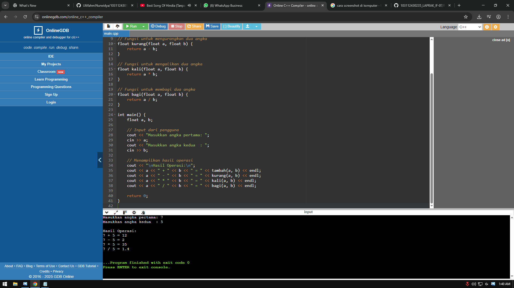

<h1 align="center">Laporan Praktikum Modul 1 <br> pengenalan cpp</h1>
<p align="center">RAFLY ADINATA PRAYOGA - 103112430235</p>

## Dasar Teori

Dalam C++, struct digunakan untuk mengelompokkan beberapa variabel menjadi satu data. Operasi aritmatika seperti tambah, kurang, kali, dan bagi digunakan untuk menghitung data. Pernyataan kondisi seperti if dan switch digunakan untuk membuat keputusan dalam program. Struktur perulangan seperti for dan while digunakan untuk mengulang kode. Sedangkan fungsi digunakan untuk membagi program menjadi bagian-bagian kecil agar lebih rapi dan mudah dipahami. Semua ini adalah dasar penting dalam membuat program C++ yang baik.

---

## Guided

### Soal 1

STRUCT

```cpp
#include <iostream>
#include <string>
using namespace std;

// Definisi struct
struct Mahasiswa {
    string nama;
    string nim;
    float ipk;
};

int main() {

    Mahasiswa mhs1;

    cout << "Masukkan Nama Mahasiswa: ";
    getline(cin, mhs1.nama);
    // cin >> mhs1.nama;
    cout << "Masukkan NIM Mahasiswa : ";
    cin >> mhs1.nim;
    cout << "Masukkan IPK Mahasiswa : ";
    cin >> mhs1.ipk;

    cout << "\n=== Data Mahasiswa ===" << endl;
    cout << "Nama : " << mhs1.nama << endl;
    cout << "NIM  : " << mhs1.nim << endl;
    cout << "IPK  : " << mhs1.ipk << endl;

    return 0;
}

```

> Output
> membuat tipe data Mahasiswa yang memiliki atribut nama, nim, dan ipk. Program meminta input dari pengguna, menyimpan data ke dalam struct, dan menampilkannya kembali ke layar.
> 


---

### Soal 2

ARITMATIKA
```cpp
#include <iostream>
using namespace std;
int main()
{
    int W, X, Y;
    float Z;
    X = 7;
    Y = 3;
    W = 1;
    Z = (X + Y) / (Y + W);
    cout << "Nilai z = " << Z << endl;
    return 0;
}
```

> Output
> operasi aritmatika dengan variabel bertipe int dan float. Nilai X, Y, dan W dijumlahkan/dibagi, lalu hasilnya (float) ditampilkan ke layar.
> 


---

### Soal 3
KONDISI

```cpp
#include <iostream>
using namespace std;
// int main()
// {
//     double tot_pembelian, diskon;
//     cout << "total pembelian: Rp";
//     cin >> tot_pembelian;
//     diskon = 0;
//     if (tot_pembelian >= 100000)
//         diskon = 0.05 * tot_pembelian;
//     cout << "besar diskon = Rp" << diskon;
// }


// int main()
// {
//     double tot_pembelian, diskon;
//     cout << "total pembelian: Rp";
//     cin >> tot_pembelian;
//     diskon = 0;
//     if (tot_pembelian >= 100000)
//         diskon = 0.05 * tot_pembelian;
//     else
//         diskon = 0;
//     cout << "besar diskon = Rp" << diskon;
// }


int main()
{
    int kode_hari;
    cout << "Menentukan hari kerja/libur\n"<<endl;
    cout << "1=Senin 3=Rabu 5=Jumat 7=Minggu "<<endl;
    cout << "2=Selasa 4=Kamis 6=Sabtu "<<endl;
    cin >> kode_hari;
    switch (kode_hari)
    {
    case 1:
    case 2:
    case 3:
    case 4:
    case 5:
        cout<<"Hari Kerja";
        break;
    case 6:
    case 7:
        cout<<"Hari Libur";
        break;
    default:
        cout<<"Kode masukan salah!!!";
    }
    return 0;
}
```

> Output
> if dan else untuk menghitung diskon berdasarkan total pembelian.
> switch untuk menentukan apakah hari tertentu adalah hari kerja atau hari libur berdasarkan kode angka.
> 


---

### Soal 4

PERULANGAN

```cpp
#include <iostream>
using namespace std;
// int main()
// {
//     int jum;
//     cout << "jumlah perulangan: ";
//     cin >> jum;
//     for (int i = 0; i < jum; i++)
//     {
//         cout << "saya sahroni\n";
//     }
//     return 1;
// }


// while
int main()
{
    int i = 1;
    int jum;
    cin >> jum;
    do
    {
        cout << "bahlil ke-" << (i + 1) << endl;
        i++;
    } while (i < jum);
    return 0;
}
```

> Output
> for loop yang mencetak teks sesuai jumlah yang dimasukkan.
> do-while loop yang mencetak teks "bahlil ke-" sebanyak input yang diberikan pengguna.
> 


---

### Soal 5

FUNGSI

```cpp
#include <iostream>
using namespace std;

// Prosedur: hanya menampilkan hasil, tidak mengembalikan nilai
void tampilkanHasil(double p, double l)
{
    cout << "\n=== Hasil Perhitungan ===" << endl;
    cout << "Panjang : " << p << endl;
    cout << "Lebar   : " << l << endl;
    cout << "Luas    : " << p * l << endl;
    cout << "Keliling: " << 2 * (p + l) << endl;
}

// Fungsi: mengembalikan nilai luas
double hitungLuas(double p, double l)
{
    return p * l;
}

// Fungsi: mengembalikan nilai keliling
double hitungKeliling(double p, double l)
{
    return 2 * (p + l);
}

int main()
{
    double panjang, lebar;

    cout << "Masukkan panjang: ";
    cin >> panjang;
    cout << "Masukkan lebar  : ";
    cin >> lebar;

    // Panggil fungsi
    double luas = hitungLuas(panjang, lebar);
    double keliling = hitungKeliling(panjang, lebar);

    cout << "\nDihitung dengan fungsi:" << endl;
    cout << "Luas      = " << luas << endl;
    cout << "Keliling  = " << keliling << endl;

    // Panggil prosedur
    tampilkanHasil(panjang, lebar);

    return 0;
}

```

> Output
> Fungsi untuk menghitung luas dan keliling persegi panjang.

> Prosedur (fungsi void) untuk menampilkan hasil perhitungan.
> Input berupa panjang dan lebar, hasilnya ditampilkan dua kali: dengan fungsi dan prosedur.
> 


---

### Soal 6

TEST

```cpp
#include <iostream>
using namespace std;
int main()
{
    string ch;
    cout << "Masukkan sebuah karakter: ";
    // cin >> ch;
    ch = getchar();  //Menggunakan getchar() untuk membaca satu karakter
    cout << "Karakter yang Anda masukkan adalah: " << ch << endl;
    return 0;
}

```

> Output
> meminta input satu karakter dari pengguna menggunakan getchar() dan kemudian menampilkannya kembali. Berfungsi untuk demonstrasi input karakter tunggal.
> 


---

## Unguided

### Soal 1

Buatlah program yang menerima input-an dua buah bilangan bertipe float, kemudian memberikan output-an hasil penjumlahan, pengurangan, perkalian, dan pembagian dari dua bilangan tersebut.

```cpp
#include <iostream>
using namespace std;

// Fungsi untuk menjumlahkan dua angka
float tambah(float a, float b) {
    return a + b;
}

// Fungsi untuk mengurangkan dua angka
float kurang(float a, float b) {
    return a - b;
}

// Fungsi untuk mengalikan dua angka
float kali(float a, float b) {
    return a * b;
}

// Fungsi untuk membagi dua angka
float bagi(float a, float b) {
    return a / b;
}

int main() {
    float a, b;

    // Input dari pengguna
    cout << "Masukkan angka pertama: ";
    cin >> a;
    cout << "Masukkan angka kedua  : ";
    cin >> b;

    // Menampilkan hasil operasi
    cout << "\nHasil Operasi:\n";
    cout << a << " + " << b << " = " << tambah(a, b) << endl;
    cout << a << " - " << b << " = " << kurang(a, b) << endl;
    cout << a << " * " << b << " = " << kali(a, b) << endl;
    cout << a << " / " << b << " = " << bagi(a, b) << endl;

    return 0;
}

```

> Output
> menerima dua input bilangan bertipe float  . kemudian menghitung hasil dari operasi penjumlahan, pengurangan, perkalian, dan pembagian. Setiap operasi dipisahkan dalam fungsi tersendiri agar kode lebih terstruktur dan mudah dibaca. Input dibaca menggunakan cin, dan hasil ditampilkan dengan cout.
> 


---

### Soal 2

Buatlah sebuah program yang menerima menerima masukan angka dan mengeluarkan output nilai angka tersebut dalam bentuk tulisan. Angka yang akan di-input-kan user adalah bilangan bulat positif mulai dari 0 s.d 100

<pre>79 : tujuh puluh sembilan</pre>

```cpp
#include <iostream>
using namespace std;

int main() {
    string satuan[]  = {"", "satu", "dua", "tiga", "empat", "lima", "enam", "tujuh", "delapan", "sembilan", "sepuluh"};
    string puluhan[] = {"", "", "dua puluh", "tiga puluh", "empat puluh", "lima puluh", 
                        "enam puluh", "tujuh puluh", "delapan puluh", "sembilan puluh"};

    int n;
    cout << "Masukkan angka (0 - 100): ";
    cin >> n;

    if (n == 0) {
        cout << "nol";
    }
    else if (n >= 1 && n <= 10) {
        cout << satuan[n];
    }
    else if (n == 11) {
        cout << "sebelas";
    }
    else if (n >= 12 && n <= 19) {
        cout << satuan[n % 10] << " belas";
    }
    else if (n >= 20 && n <= 99) {
        cout << puluhan[n / 10] << " " << satuan[n % 10];
    }
    else if (n == 100) {
        cout << "seratus";
    }
    else {
        cout << "Angka di luar jangkauan (0 - 100)";
    }

    return 0;
}

```

> Output
> mengubah input berupa angka bulat dari 0 hingga 100 menjadi bentuk tulisan dalam Bahasa Indonesia. Program menggunakan array untuk menyimpan nama-nama angka satuan dan puluhan, serta menggunakan logika percabangan if-else untuk menangani kondisi khusus seperti angka 11, belasan, dan 100. Operator pembagian (/) dan modulo (%) digunakan untuk memisahkan digit puluhan dan satuan.
> 


---

### Soal 3

Buatlah program yang dapat memberikan input dan output sebagai berikut.

<pre>
input  : 3
output :
321*123
 21*12
  1*1
   *
</pre>

```cpp
#include <iostream>
using namespace std;

int main() {
    int n;

    // Input dari pengguna
    cout << "Masukkan angka n: ";
    cin >> n;

    // Baris atas pola
    for (int i = n; i >= 1; i--) {
        // Spasi di awal
        for (int spasi = 0; spasi < n - i; spasi++) {
            cout << " ";
        }

        // Angka menurun
        for (int j = i; j >= 1; j--) {
            cout << j;
        }

        // Bintang tengah
        cout << "*";

        // Angka menaik
        for (int j = 1; j <= i; j++) {
            cout << j;
        }

        cout << endl;
    }

    // Baris bawah (ekor bintang)
    for (int spasi = 0; spasi < n; spasi++) {
        cout << " ";
    }
    cout << "*";

    return 0;
}

```

> Output
> mencetak pola berbentuk segitiga terbalik yang terdiri dari angka menurun di sebelah kiri, simbol * di tengah, dan angka menaik di sebelah kanan. Pola ini dibentuk menggunakan perulangan for bersarang, dengan tinggi pola ditentukan berdasarkan input dari pengguna. Baris terakhir hanya menampilkan satu simbol * di tengah.
> 


## Referensi

https://www.duniailkom.com/tutorial-belajar-c-plus-plus-cara-membuat-fungsi-bahasa-c-plus-plus/#google_vignette (diakses 27 September 2025)
https://www.youtube.com/watch?v=hVzmJwyMH2Q&t=10s (diakses 29 September 2025)
https://www.belajarcpp.com/tutorial/cpp/struct/ (diakses 29 September 2025)
https://www.duniailkom.com/tutorial-belajar-c-plus-plus-perulangan-while-bahasa-c-plus-plus/ (diakses 30 September 2025)
