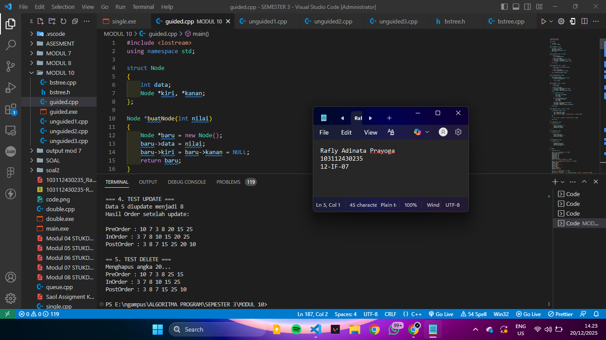
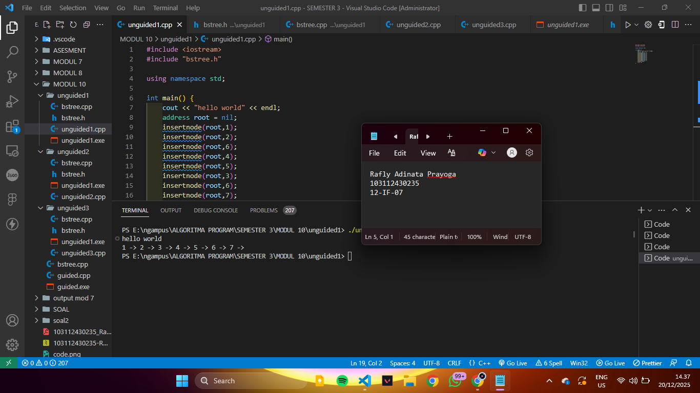
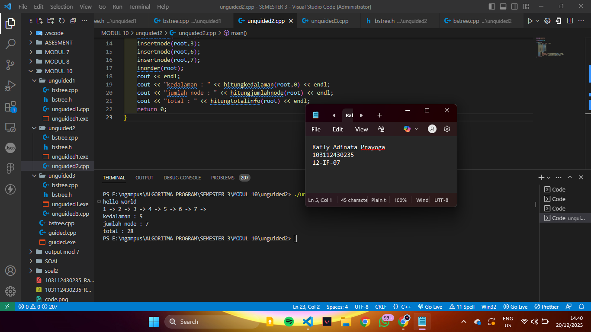
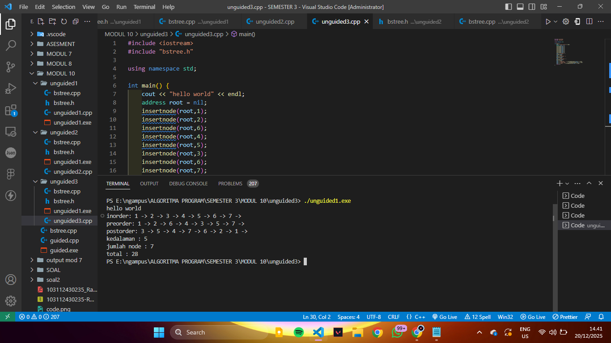

<h1 align="center">Laporan Praktikum Modul 10  <br>TREE bag 1</h1>
<p align="center">RAFLY ADINATA PRAYOGA - 103112430235</p>

## Dasar Teori

TREE di cpp adalah strukdat yang bentuknya hirarki dan terdiri dari kumpulan node yang terhubung melalui relasi induk dan anak. 

node paling atas disebut root, node dibawahnya disebut child dan node yang tidak memiliki child disebut leaf. Struktur tree biasanya diimplementasikan menggunakan struct atau class dengan bantuan pointer. Tree sering digunakan untuk merepresentasikan data bertingkat seperti struktur folder, silsilah, dan untuk mempercepat proses pencarian serta pengolahan data.

## Guided

### Soal 1

> 
```
#include <iostream>
using namespace std;

struct Node
{
    int data;
    Node *kiri, *kanan;
};

Node *buatNode(int nilai)
{
    Node *baru = new Node();
    baru->data = nilai;
    baru->kiri = baru->kanan = NULL;
    return baru;
}

Node *insert(Node *root, int nilai)
{
    if (root == NULL)
        return buatNode(nilai);
    
    if (nilai < root->data)
        root->kiri = insert(root->kiri, nilai);
    else if (nilai > root->data)
        root->kanan = insert(root->kanan, nilai);

    return root;
}

Node *search(Node *root, int nilai)
{
    if (root == NULL || root->data == nilai)
        return root;

    if (nilai < root->data)
        return search(root->kiri, nilai);

    return search(root->kanan, nilai);
}

Node *nilaiTerkecil(Node *node)
{
    Node *current = node;
    while (current && current->kiri != NULL)
        current = current->kiri;

        return current;
}

Node *hapus(Node *root, int nilai)
{
    if (root == NULL)
        return root;

    if (nilai < root->data)
        root->kiri = hapus(root->kiri, nilai);
    else if (nilai > root->data)
        root->kanan = hapus(root->kanan, nilai);
    else
    {
        if (root->kiri == NULL)
        {
            Node *temp = root->kanan;
            delete root;
            return temp;
        }
        else if (root->kanan == NULL){
            Node *temp = root->kiri;
            delete root;
            return temp;
        }
        Node *temp = nilaiTerkecil(root->kanan);
        root->data = temp->data;
        root->kanan = hapus(root->kanan, temp->data);
    }
    return root;
}

Node *update(Node *root, int Lama, int baru)
{
    if (search(root, Lama) != NULL)
    {
        root = hapus(root, Lama);
        root = insert(root, baru);
        cout << "Data " << Lama << " diupdate menjadi " << baru << endl;
    }
    else
    {
        cout << "Data " << Lama << " tidak ditemukan!" << endl;
    }
    return root;
}

void preOrder(Node *root)
{
    if (root != NULL)
    {
        cout << root->data << " ";
        preOrder(root->kiri);
        preOrder(root->kanan);
    }
}

void inOrder(Node *root)
{
    if (root != NULL)
    {
        inOrder(root->kiri);
        cout << root->data << " ";
        inOrder(root->kanan);
    }
}

void postOrder(Node *root)
{
    if (root != NULL)
    {
        postOrder(root->kiri);
        postOrder(root->kanan);
        cout << root->data << " ";
    }
}

int main()
{
    Node *root = NULL;

    cout << "=== 1. INSERT DATA ===" << endl;
    root = insert(root, 10);
    insert(root, 5);
    insert(root, 20);
    insert(root, 3);
    insert(root, 7);
    insert(root, 15);
    insert(root, 25);
    cout << "Data berhasil dimasukan.\n" << endl;

    cout << "=== 2. TAMPILKAN TREE (TRAVELSAL) ===" << endl;
    cout << "PreOrder : ";
    preOrder(root);
    cout << endl;
    cout << "InOrder : ";
    inOrder(root);
    cout << endl;
    cout << "PostOrder : ";
    postOrder(root);
    cout << "\n" << endl;

    cout << "=== 3. TEST SEARCH ===" << endl;
    int cari1 = 7, cari2 = 99;
    cout << "Cari " << cari1 << ": " << (search(root,cari1) ? "Ketemu" : "Tidak Aada") << endl;
    cout << "Cari " << cari2 << ": " << (search(root,cari2) ? "Ketemu" : "Tidak Aada") << endl;
    cout << endl;

    cout << "=== 4. TEST UPDATE ===" << endl;
    root = update(root, 5, 8);
    cout << "Hasil Order setelah update: ";
    cout << endl;
    cout << endl;

    cout << "PreOrder : ";
    preOrder(root);
    cout << endl;
    cout << "InOrder : ";
    inOrder(root);
    cout << endl;
    cout << "PostOrder : ";
    postOrder(root);
    cout << "\n" << endl;

    cout << "== 5. TEST DELETE ===" << endl;
    cout << "Menghapus angka 20..." << endl;
    root = hapus(root, 20);

    cout << "PreOrder : ";
    preOrder(root);
    cout << endl;
    cout << "InOrder : ";
    inOrder(root);
    cout << endl;
    cout << "PostOrder : ";
    postOrder(root);
    cout << "\n" << endl;

    return 0;
}
```

> Output
> 
> 


## Unguided

### Soal 1


>bstree.cpp
```cpp
#include "bstree.h"

address alokasi(infotype x) {
	address p = new node;
	p->info = x;
	p->left = nil;
	p->right = nil;
	return p;
}

void insertnode(address &root, infotype x) {
	if (root == nil) {
		root = alokasi(x);
	}
	else if (x < root->info) {
		insertnode(root->left, x);
	}
	else if (x > root->info) {
		insertnode(root->right, x);
	}
}

address findnode(infotype x, address root) {
	if (root == nil || root->info == x) {
		return root;
	}
	if (x < root->info) {
		return findnode(x, root->left);
	}
	return findnode(x, root->right);
}

void inorder(address root) {
	if (root != nil) {
		inorder(root->left);
		cout << root->info << " -> ";
		inorder(root->right);
	}
}
```
>bstree.h
```cpp
#ifndef BSTREE_H
#define BSTREE_H

#include <iostream>
using namespace std;

typedef int infotype;

struct node {
	infotype info;
	node *left, *right;
};

typedef node* address;

#define nil NULL

address alokasi(infotype x);
void insertnode(address &root, infotype x);
address findnode(infotype x, address root);
void inorder(address root);

#endif
```
>main.cpp
```cpp
#include <iostream>
#include "bstree.h"

using namespace std;

int main() {
	cout << "hello world" << endl;
	address root = nil;
	insertnode(root,1);
	insertnode(root,2);
	insertnode(root,6);
	insertnode(root,4);
	insertnode(root,5);
	insertnode(root,3);
	insertnode(root,6);
	insertnode(root,7);
	inorder(root);
	return 0;
}
```

> Output
> 
> 

---

### Soal 2

2. 

>bstree.cpp
```cpp
#include "bstree.h"

address alokasi(infotype x) {
	address p = new node;
	p->info = x;
	p->left = nil;
	p->right = nil;
	return p;
}

void insertnode(address &root, infotype x) {
	if (root == nil) {
		root = alokasi(x);
	}
	else if (x < root->info) {
		insertnode(root->left, x);
	}
	else if (x > root->info) {
		insertnode(root->right, x);
	}
}

address findnode(infotype x, address root) {
	if (root == nil || root->info == x) {
		return root;
	}
	if (x < root->info) {
		return findnode(x, root->left);
	}
	return findnode(x, root->right);
}

void inorder(address root) {
	if (root != nil) {
		inorder(root->left);
		cout << root->info << " -> ";
		inorder(root->right);
	}
}

int hitungjumlahnode(address root) {
	if (root == nil) {
		return 0;
	}
	return 1 + hitungjumlahnode(root->left) + hitungjumlahnode(root->right);
}

int hitungtotalinfo(address root) {
	if (root == nil) {
		return 0;
	}
	return root->info + hitungtotalinfo(root->left) + hitungtotalinfo(root->right);
}

int hitungkedalaman(address root, int start) {
	if (root == nil) {
		return start;
	}
	int kiri = hitungkedalaman(root->left, start + 1);
	int kanan = hitungkedalaman(root->right, start + 1);
	return (kiri > kanan ? kiri : kanan);
}
```
>bstree.h
```cpp
#ifndef BSTREE_H
#define BSTREE_H

#include <iostream>
using namespace std;

typedef int infotype;

struct node {
	infotype info;
	node *left, *right;
};

typedef node* address;

#define nil NULL

address alokasi(infotype x);
void insertnode(address &root, infotype x);
address findnode(infotype x, address root);
void inorder(address root);
int hitungjumlahnode(address root);
int hitungtotalinfo(address root);
int hitungkedalaman(address root, int start);

#endif
```
>main.cpp
```cpp
#include <iostream>
#include "bstree.h"

using namespace std;

int main() {
	cout << "hello world" << endl;
	address root = nil;
	insertnode(root,1);
	insertnode(root,2);
	insertnode(root,6);
	insertnode(root,4);
	insertnode(root,5);
	insertnode(root,3);
	insertnode(root,6);
	insertnode(root,7);
	inorder(root);
	cout << endl;
	cout << "kedalaman : " << hitungkedalaman(root,0) << endl;
	cout << "jumlah node : " << hitungjumlahnode(root) << endl;
	cout << "total : " << hitungtotalinfo(root) << endl;
	return 0;
}
```

> Output
> 
> 


------

### Soal 3

3. 

>bstree.cpp
```cpp
#include "bstree.h"

address alokasi(infotype x) {
	address p = new node;
	p->info = x;
	p->left = nil;
	p->right = nil;
	return p;
}

void insertnode(address &root, infotype x) {
	if (root == nil) {
		root = alokasi(x);
	}
	else if (x < root->info) {
		insertnode(root->left, x);
	}
	else if (x > root->info) {
		insertnode(root->right, x);
	}
}

address findnode(infotype x, address root) {
	if (root == nil || root->info == x) {
		return root;
	}
	if (x < root->info) {
		return findnode(x, root->left);
	}
	return findnode(x, root->right);
}

void inorder(address root) {
	if (root != nil) {
		inorder(root->left);
		cout << root->info << " -> ";
		inorder(root->right);
	}
}

int hitungjumlahnode(address root) {
	if (root == nil) {
		return 0;
	}
	return 1 + hitungjumlahnode(root->left) + hitungjumlahnode(root->right);
}

int hitungtotalinfo(address root) {
	if (root == nil) {
		return 0;
	}
	return root->info + hitungtotalinfo(root->left) + hitungtotalinfo(root->right);
}

int hitungkedalaman(address root, int start) {
	if (root == nil) {
		return start;
	}
	int kiri = hitungkedalaman(root->left, start + 1);
	int kanan = hitungkedalaman(root->right, start + 1);
	return (kiri > kanan ? kiri : kanan);
}

void preorder(address root) {
	if (root != nil) {
		cout << root->info << " -> ";
		preorder(root->left);
		preorder(root->right);
	}
}

void postorder(address root) {
	if (root != nil) {
		postorder(root->left);
		postorder(root->right);
		cout << root->info << " -> ";
	}
}
```
>bstree.h
```cpp
#ifndef BSTREE_H
#define BSTREE_H

#include <iostream>
using namespace std;

typedef int infotype;

struct node {
	infotype info;
	node *left, *right;
};

typedef node* address;

#define nil NULL

address alokasi(infotype x);
void insertnode(address &root, infotype x);
address findnode(infotype x, address root);
void inorder(address root);
int hitungjumlahnode(address root);
int hitungtotalinfo(address root);
int hitungkedalaman(address root, int start);
void preorder(address root);
void postorder(address root);

#endif
```
>main.cpp
```cpp
#include <iostream>
#include "bstree.h"

using namespace std;

int main() {
	cout << "hello world" << endl;
	address root = nil;
	insertnode(root,1);
	insertnode(root,2);
	insertnode(root,6);
	insertnode(root,4);
	insertnode(root,5);
	insertnode(root,3);
	insertnode(root,6);
	insertnode(root,7);
	cout << "inorder: ";
	inorder(root);
	cout << endl;
	cout << "preorder: ";
	preorder(root);
	cout << endl;
	cout << "postorder: ";
	postorder(root);
	cout << endl;
	cout << "kedalaman : " << hitungkedalaman(root,0) << endl;
	cout << "jumlah node : " << hitungjumlahnode(root) << endl;
	cout << "total : " << hitungtotalinfo(root) << endl;
	return 0;
}
```

> Output
> 
> 

## Referensi
> 

