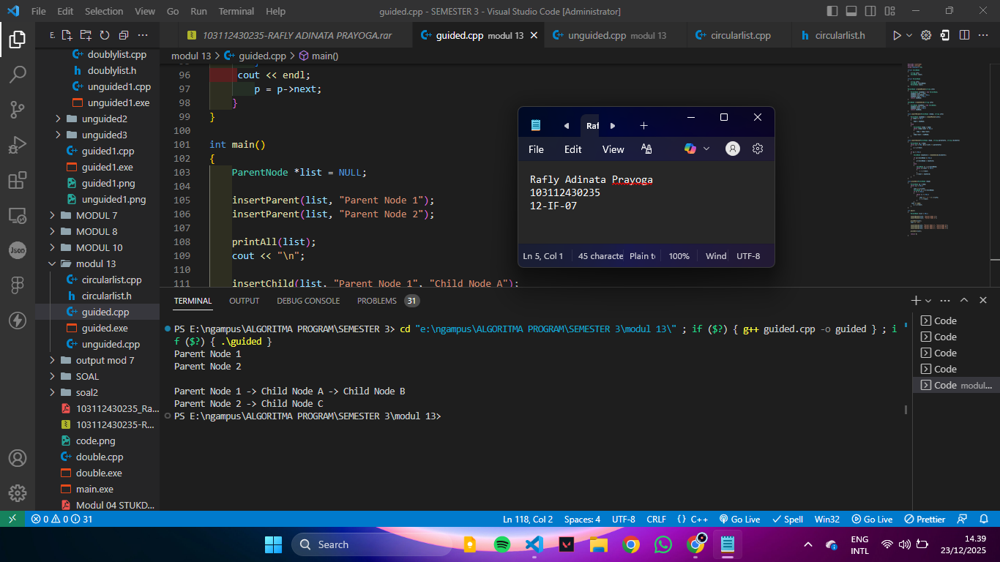

<h1 align="center">Laporan Praktikum Modul 13 <br>multi linked list</h1>
<p align="center">RAFLY ADINATA PRAYOGA - 103112430235</p>

## Dasar Teori

---
Multi linked list adalah linked list dengan lebih dari satu pointer per node yang digunakan untuk mengelola relasi antar data. Sangat cocok untuk sistem many-to-many.

## Guided

### Soal 1

> 
```cpp
#include <iostream>
#include <string>
using namespace std;

struct ChildNode
{
    string info;
    ChildNode *next;
};

struct ParentNode
{
    string info;
    ChildNode *childHead;
    ParentNode *next;
};

ParentNode *createParent(string info)
{
    ParentNode *newNode = new ParentNode;
    newNode->info = info;
    newNode->childHead = NULL;
    newNode->next = NULL;
    return newNode;
}

ChildNode *createChild(string info)
{
    ChildNode *newNode = new ChildNode;
    newNode->info = info;
    newNode->next = NULL;
    return newNode;
}

void insertParent(ParentNode *&head, string info)
{
    ParentNode *newNode = createParent(info);
    if (head == NULL)
    {
        head = newNode;
    }
    else
    {
        ParentNode *temp = head;
        while (temp->next != NULL)
        {
            temp = temp->next;
        }
        temp->next = newNode;
    }
}

void insertChild(ParentNode *head, string parentInfo, string childInfo)
{
    ParentNode *p = head;
    while (p != NULL && p->info != parentInfo)
    {
        p = p->next;
    }
    
    if (p != NULL)
    {
        ChildNode *newChild = createChild(childInfo);
        
        if (p->childHead == NULL)
        {
            p->childHead = newChild;
        }
        else
        {
            ChildNode *c = p->childHead;
            while (c->next != NULL)
            {
                c = c->next;
            }
            c->next = newChild;
        }
    }
}

void printAll(ParentNode *head)
{
    ParentNode *p = head;
    while (p != NULL)
    {
        cout << p->info;
        ChildNode *c = p->childHead;
        if (c != NULL)
        {
            while (c != NULL)
            {
                cout << " -> " << c->info;
                c = c->next;
            }
        }
     cout << endl;
        p = p->next;
    }
}

int main()
{
    ParentNode *list = NULL;
    
    insertParent(list, "Parent Node 1");
    insertParent(list, "Parent Node 2");
    
    printAll(list);
    cout << "\n";
    
    insertChild(list, "Parent Node 1", "Child Node A");
    insertChild(list, "Parent Node 1", "Child Node B");
    insertChild(list, "Parent Node 2", "Child Node C");
    
    printAll(list);
    
    return 0;
}
```

> Output
> 
> 


## Unguided

### Soal 1


```cpp

```

> Output
> 
> 

---

### Soal 2

2. 

```cpp

```

> Output
> 
> 


---

### Soal 3

3. 

```cpp

```

> Output
> 
> 

## Referensi
> 

