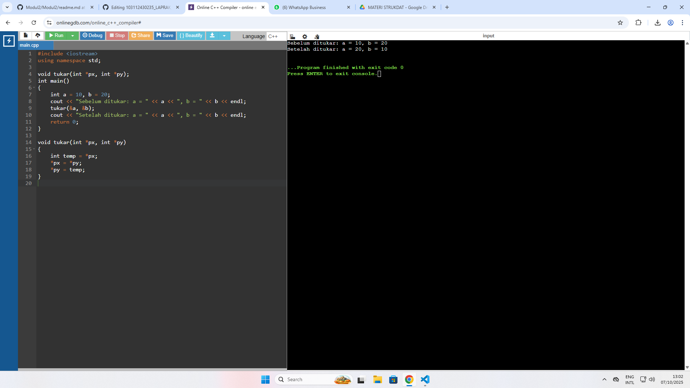
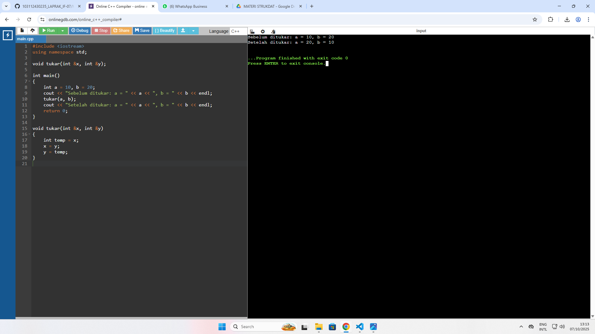
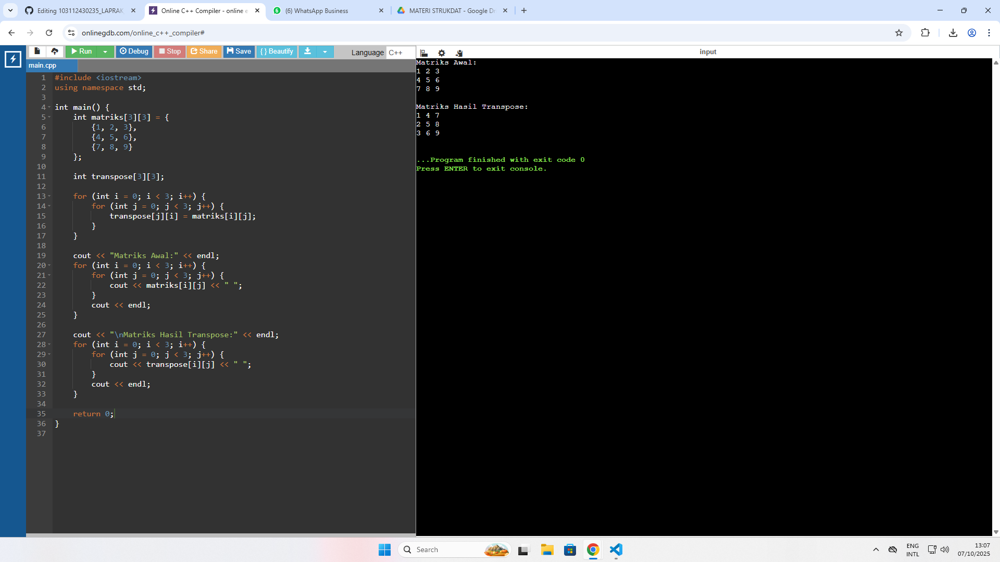
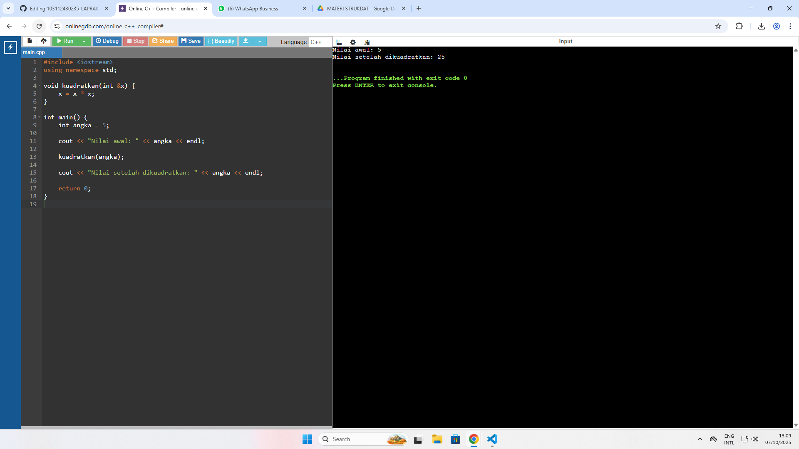

<h1 align="center">Laporan Praktikum Modul 1 <br> pengenalan cpp part 2</h1>
<p align="center">RAFLY ADINATA PRAYOGA - 103112430235</p>

## Dasar Teori
Call by Pointer dan Call by Reference adalah dua teknik dalam pemanggilan fungsi yang memungkinkan kita untuk mengubah nilai asli dari variabel yang dikirimkan ke fungsi. 

Call by Pointer menggunakan konsep alamat memori, variabel yang dikirimkan ke fungsi akan diakses melalui pointer. Tanda * digunakan untuk mendeklarasikan pointer dan mengakses nilai yang ditunjuk, sedangkan & digunakan saat memanggil fungsi untuk mengirimkan alamat variabel.

Call by Reference adalah fitur khas bahasa C++ yang menggunakan simbol & di parameter fungsi untuk menyatakan bahwa variabel dikirim sebagai referensi.variabel dalam fungsi merujuk langsung ke variabel asli di luar fungsi, sehingga perubahan yang dilakukan akan berdampak langsung pada variabel tersebut.

---

## Guided

### Soal 1

CALL BY POINTER

```cpp
#include <iostream>
using namespace std;

void tukar(int *px, int *py);   
int main()
{
    int a = 10, b = 20;
    cout << "Sebelum ditukar: a = " << a << ", b = " << b << endl;
    tukar(&a, &b);
    cout << "Setelah ditukar: a = " << a << ", b = " << b << endl;
    return 0;
}

void tukar(int *px, int *py)
{
    int temp = *px;
    *px = *py;
    *py = temp;
}

```

> Output
> Fungsi tukar() menerima dua pointer ke int (*px dan *py).

*px artinya nilai di alamat yang ditunjuk oleh px.

Proses menukar:

Simpan nilai *px ke temp.

Salin nilai *py ke *px.

Salin temp ke *py.
> 


---

### Soal 2

CALL BY REFERENCE
```cpp
#include <iostream>
using namespace std;

void tukar(int &x, int &y);   

int main()
{
    int a = 10, b = 20;
    cout << "Sebelum ditukar: a = " << a << ", b = " << b << endl;
    tukar(a, b);
    cout << "Setelah ditukar: a = " << a << ", b = " << b << endl;
    return 0;
}

void tukar(int &x, int &y)
{
    int temp = x;
    x = y;
    y = temp;
}

```

> Output
> Fungsi tukar() menerima dua variabel by reference.

Artinya: x dan y langsung mereferensikan a dan b dari main() — tanpa pointer.
> 


---

## Unguided

### Soal 1

1. Buatlah sebuah program untuk melakukan transpose pada sebuah matriks persegi berukuran 3x3. Operasi transpose adalah mengubah baris menjadi kolom dan sebaliknya. Inisialisasi matriks awal di dalam kode, kemudian buat logika untuk melakukan transpose dan simpan hasilnya ke dalam matriks baru. Terakhir, tampilkan matriks awal dan matriks hasil transpose.

Contoh Output:

Matriks Awal:
1 2 3
4 5 6
7 8 9

Matriks Hasil Transpose:
1 4 7
2 5 8
3 6 9

```cpp
#include <iostream>
using namespace std;

int main() {
    int matriks[3][3] = {
        {1, 2, 3},
        {4, 5, 6},
        {7, 8, 9}
    };

    int transpose[3][3];
    
    for (int i = 0; i < 3; i++) {
        for (int j = 0; j < 3; j++) {
            transpose[j][i] = matriks[i][j];
        }
    }

    cout << "Matriks Awal:" << endl;
    for (int i = 0; i < 3; i++) {
        for (int j = 0; j < 3; j++) {
            cout << matriks[i][j] << " ";
        }
        cout << endl;
    }

    cout << "\nMatriks Hasil Transpose:" << endl;
    for (int i = 0; i < 3; i++) {
        for (int j = 0; j < 3; j++) {
            cout << transpose[i][j] << " ";
        }
        cout << endl;
    }

    return 0;
}


```

> Output
> Loop ini menukar baris dan kolom.

Misal:

matriks[0][1] = 2 akan dipindahkan ke transpose[1][0].
> 

---

### Soal 2

2. Buatlah program yang menunjukkan penggunaan call by reference. Buat sebuah prosedur bernama kuadratkan yang menerima satu parameter integer secara referensi (&). Prosedur ini akan mengubah nilai asli variabel yang dilewatkan dengan nilai kuadratnya. Tampilkan nilai variabel di main() sebelum dan sesudah memanggil prosedur untuk membuktikan perubahannya. 

Contoh Output:

Nilai awal: 5
Nilai setelah dikuadratkan: 25


```cpp
#include <iostream>
using namespace std;

void kuadratkan(int &x) {
    x = x * x;
}

int main() {
    int angka = 5;

    cout << "Nilai awal: " << angka << endl;

    kuadratkan(angka);

    cout << "Nilai setelah dikuadratkan: " << angka << endl;

    return 0;
}

```

> Output
> Fungsi ini menerima parameter integer by reference.

Nilai x diubah menjadi kuadratnya (x²) langsung mengubah variabel asli.
> 


---


## Referensi

https://www.duniailkom.com/tutorial-belajar-c-plus-plus-cara-membuat-fungsi-bahasa-c-plus-plus/#google_vignette (diakses 27 September 2025)
https://www.youtube.com/watch?v=hVzmJwyMH2Q&t=10s (diakses 29 September 2025)
https://www.belajarcpp.com/tutorial/cpp/struct/ (diakses 29 September 2025)
https://www.duniailkom.com/tutorial-belajar-c-plus-plus-perulangan-while-bahasa-c-plus-plus/ (diakses 30 September 2025)
