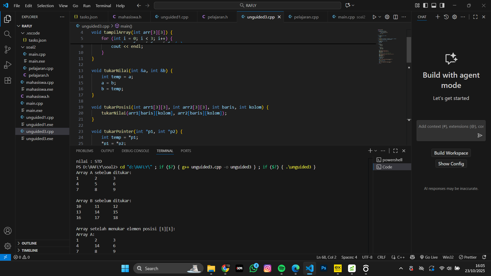

<h1 align="center">Laporan Praktikum Modul 3 <br>Abstract Data Type</h1>
<p align="center">RAFLY ADINATA PRAYOGA - 103112430235</p>

## Dasar Teori
Abstract Data Type (ADT) atau Tipe Data Abstrak adalah konsep penting dalam pemrograman yang menjelaskan bagaimana sebuah tipe data bekerja secara logis, tanpa memikirkan bagaimana cara kerjanya di dalam.

ADT berisi dua hal utama:

Kumpulan data yang disimpan.

Operasi yang bisa dilakukan pada data tersebut (seperti menambah, menghapus, mencari, dll).

---

## Guided

### Soal 1

> mahasiswa.cpp
```mahasiswa.cpp
#include "mahasiswa.h"
#include <iostream>
using namespace std;

void inputMhs(mahasiswa &m)
{
 cout << "input nama = ";
 cin >> (m) .nim;
 cout << "input nilai = ";
 cin >> (m) .nilai1;
 cout << "input niali2 = ";
 cin >> m .nilai2;

}
float rata2(mahasiswa m)
{
 return float(m.nilai1 + m.nilai2) / 2;
}


```
> mahasiswa.h
```mahasiswa.h
#ifndef MAHASISWA_H_INCLUDED
#define MAHASISWA_H_INCLUDED

struct mahasiswa
{
 char nim[10];
 int nilai1, nilai2;
};

void inputMhs(mahasiswa &m);
float rata2(mahasiswa m);

#endif


```
> main.cpp
```main.cpp
#include <iostream>
#include "mahasiswa.h"
using namespace std;

int main(){
    mahasiswa mhs;
    inputMhs(mhs);
    cout << "rata rata = " << rata2(mhs);
    return 0;
}

```

> Output
> 
> 


## Unguided

### Soal 1

Buat program yang dapat menyimpan data mahasiswa (max. 10) ke dalam sebuah array dengan field nama, nim, uts, uas, tugas, dan nilai akhir. Nilai akhir diperoleh dari FUNGSI dengan rumus 0.3uts+0.4uas+0.3*tugas.


```cpp
#include <iostream>
#include <string>
using namespace std;

struct Mahasiswa {
    string nama;
    string nim;
    float uts, uas, tugas, nilaiAkhir;
};

float hitungNilaiAkhir(float uts, float uas, float tugas) {
    return uts * 0.3 + uas * 0.4 + tugas * 0.3;
}

void inputMahasiswa(Mahasiswa &mhs) {
    cout << "Masukkan Nama    : ";
    getline(cin, mhs.nama);
    cout << "Masukkan NIM     : ";
    getline(cin, mhs.nim);
    cout << "Masukkan Nilai UTS   : ";
    cin >> mhs.uts;
    cout << "Masukkan Nilai UAS   : ";
    cin >> mhs.uas;
    cout << "Masukkan Nilai Tugas : ";
    cin >> mhs.tugas;
    mhs.nilaiAkhir = hitungNilaiAkhir(mhs.uts, mhs.uas, mhs.tugas);
}

void tampilMahasiswa(Mahasiswa mhs[], int jumlah) {
    cout << "\n================ DAFTAR MAHASISWA ================\n";
    for (int i = 0; i < jumlah; i++) {
        cout << "\nMahasiswa ke-" << i + 1 << endl;
        cout << "Nama        : " << mhs[i].nama << endl;
        cout << "NIM         : " << mhs[i].nim << endl;
        cout << "Nilai UTS   : " << mhs[i].uts << endl;
        cout << "Nilai UAS   : " << mhs[i].uas << endl;
        cout << "Nilai Tugas : " << mhs[i].tugas << endl;
        cout << "Nilai Akhir : " << mhs[i].nilaiAkhir << endl;
        cout << "--------------------------------------------------\n";
    }
}

int main() {
    Mahasiswa daftarMhs[10];
    int jumlah;

    cout << "Masukkan jumlah mahasiswa (max 10): ";
    cin >> jumlah;
    cin.ignore();

    if (jumlah < 1 || jumlah > 10) {
        cout << "Jumlah mahasiswa tidak valid!" << endl;
        return 0;
    }

    for (int i = 0; i < jumlah; i++) {
        cout << "\nInput data mahasiswa ke-" << i + 1 << endl;
        inputMahasiswa(daftarMhs[i]);
    }

    tampilMahasiswa(daftarMhs, jumlah);

    return 0;
}


```

> Output
> 
> 

---

### Soal 2

2. Buatlah ADT pelajaran sebagai berikut di dalam file “pelajaran.h”
   Buatlah implementasi ADT pelajaran pada file “pelajaran.cpp” Cobalah hasil implementasi ADT pada file “main.cpp”

>pelajaran.h
```cpp
#ifndef PELAJARAN_H_INCLUDED
#define PELAJARAN_H_INCLUDED

#include <string>
using namespace std;

struct pelajaran {
    string namaMapel;
    string kodeMapel;
};

pelajaran create_pelajaran(string namapel, string kodepel);

void tampil_pelajaran(pelajaran pel);

#endif
```
>pelajaran.cpp
```cpp
#include <iostream>
#include "pelajaran.h"
using namespace std;

pelajaran create_pelajaran(string namapel, string kodepel) {
    pelajaran p;
    p.namaMapel = namapel;
    p.kodeMapel = kodepel;
    return p;
}

void tampil_pelajaran(pelajaran pel) {
    cout << "nama pelajaran : " << pel.namaMapel << endl;
    cout << "nilai : " << pel.kodeMapel << endl;
}
```
main.cpp
```cpp
#include <iostream>
#include "pelajaran.h"
using namespace std;

int main() {
    string namapel = "Struktur Data";
    string kodepel = "STD";

    pelajaran pel = create_pelajaran(namapel, kodepel);

    tampil_pelajaran(pel);

    return 0;
}
```

> Output
> 
> 


---

### Soal 3

3. Buatlah ADT pelajaran sebagai berikut di dalam file “pelajaran.h”
   Buatlah implementasi ADT pelajaran pada file “pelajaran.cpp” Cobalah hasil implementasi ADT pada file “main.cpp”

```cpp
#include <iostream>
using namespace std;

void tampilArray(int arr[3][3]) {
    for (int i = 0; i < 3; i++) {
        for (int j = 0; j < 3; j++) {
            cout << arr[i][j] << "\t";
        }
        cout << endl;
    }
}

void tukarNilai(int &a, int &b) {
    int temp = a;
    a = b;
    b = temp;
}

void tukarPosisi(int arr1[3][3], int arr2[3][3], int baris, int kolom) {
    tukarNilai(arr1[baris][kolom], arr2[baris][kolom]);
}

void tukarPointer(int *p1, int *p2) {
    int temp = *p1;
    *p1 = *p2;
    *p2 = temp;
}

int main() {
    int A[3][3] = {
        {1, 2, 3},
        {4, 5, 6},
        {7, 8, 9}
    };

    int B[3][3] = {
        {10, 11, 12},
        {13, 14, 15},
        {16, 17, 18}
    };

    cout << "Array A sebelum ditukar:\n";
    tampilArray(A);
    cout << "\nArray B sebelum ditukar:\n";
    tampilArray(B);

    tukarPosisi(A, B, 1, 1); // Tukar elemen [1][1]

    cout << "\nArray setelah menukar elemen posisi [1][1]:\n";
    cout << "Array A:\n";
    tampilArray(A);
    cout << "\nArray B:\n";
    tampilArray(B);

    int x = 50, y = 100;
    int *ptrX = &x;
    int *ptrY = &y;

    cout << "\nNilai sebelum ditukar melalui pointer:\n";
    cout << "x = " << x << ", y = " << y << endl;

    tukarPointer(ptrX, ptrY);

    cout << "Nilai setelah ditukar melalui pointer:\n";
    cout << "x = " << x << ", y = " << y << endl;

    return 0;
}
```

> Output
> 
> 

## Referensi

https://www.geeksforgeeks.org/cpp/pointers-vs-references-cpp/ (diakses 5 Oktober 2025)
https://www.w3schools.com/cpp/cpp_pointers.asp (diakses 5 Oktober 2025)
https://codefinity.com/blog/References-vs-Pointers-in-C-plus-plus (diakses 6 Oktober 2025)
