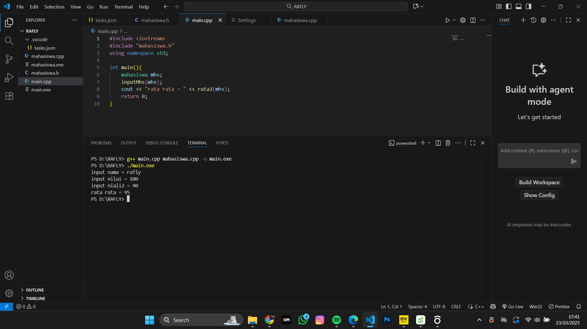
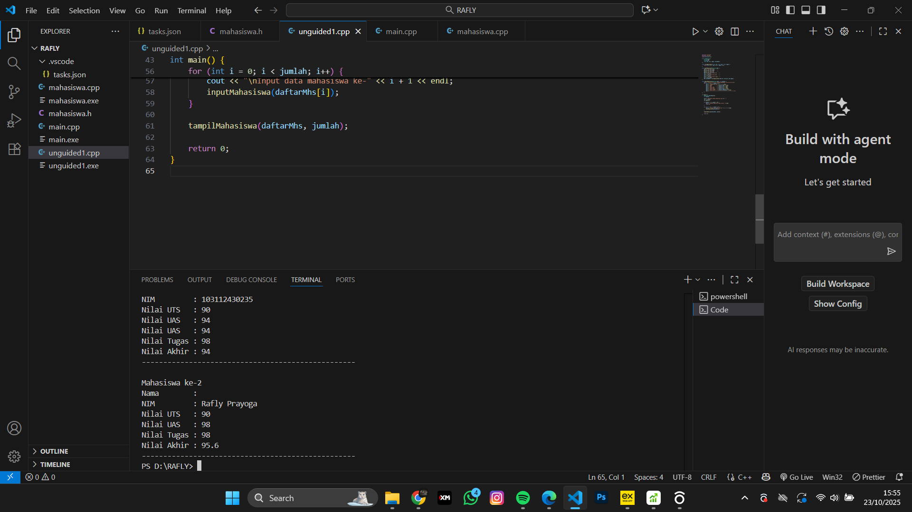
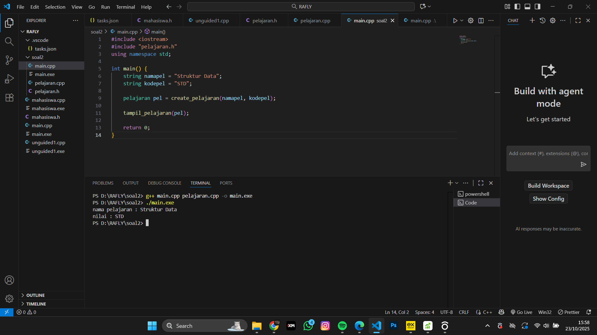

<h1 align="center">Laporan Praktikum Modul 3 <br>Abstract Data Type</h1>
<p align="center">RAFLY ADINATA PRAYOGA - 103112430235</p>

## Dasar Teori
Abstract Data Type (ADT) atau Tipe Data Abstrak adalah konsep penting dalam pemrograman yang menjelaskan bagaimana sebuah tipe data bekerja secara logis, tanpa memikirkan bagaimana cara kerjanya di dalam.

ADT berisi dua hal utama:

Kumpulan data yang disimpan.

Operasi yang bisa dilakukan pada data tersebut (seperti menambah, menghapus, mencari, dll).

---

## Guided

### Soal 1

> mahasiswa.cpp
```mahasiswa.cpp
#include "mahasiswa.h"
#include <iostream>
using namespace std;

void inputMhs(mahasiswa &m)
{
 cout << "input nama = ";
 cin >> (m) .nim;
 cout << "input nilai = ";
 cin >> (m) .nilai1;
 cout << "input niali2 = ";
 cin >> m .nilai2;

}
float rata2(mahasiswa m)
{
 return float(m.nilai1 + m.nilai2) / 2;
}


```
> mahasiswa.h
```mahasiswa.h
#ifndef MAHASISWA_H_INCLUDED
#define MAHASISWA_H_INCLUDED

struct mahasiswa
{
 char nim[10];
 int nilai1, nilai2;
};

void inputMhs(mahasiswa &m);
float rata2(mahasiswa m);

#endif


```
> main.cpp
```main.cpp
#include <iostream>
#include "mahasiswa.h"
using namespace std;

int main(){
    mahasiswa mhs;
    inputMhs(mhs);
    cout << "rata rata = " << rata2(mhs);
    return 0;
}

```

> Output
> Fungsi tukar() menerima dua pointer ke int (*px dan *py).
*px artinya nilai di alamat yang ditunjuk oleh px.
Proses menukar:
Simpan nilai *px ke temp.
Salin nilai *py ke *px.
Salin temp ke *py.
> 


---

### Soal 2

CALL BY REFERENCE
```cpp
#include <iostream>
using namespace std;

void tukar(int &x, int &y);   

int main()
{
    int a = 10, b = 20;
    cout << "Sebelum ditukar: a = " << a << ", b = " << b << endl;
    tukar(a, b);
    cout << "Setelah ditukar: a = " << a << ", b = " << b << endl;
    return 0;
}

void tukar(int &x, int &y)
{
    int temp = x;
    x = y;
    y = temp;
}

```

> Output
> Fungsi tukar() menerima dua variabel by reference.
Artinya: x dan y langsung mereferensikan a dan b dari main() — tanpa pointer.
> 


---

## Unguided

### Soal 1

1. Buatlah sebuah program untuk melakukan transpose pada sebuah matriks persegi berukuran 3x3. Operasi transpose adalah mengubah baris menjadi kolom dan sebaliknya. Inisialisasi matriks awal di dalam kode, kemudian buat logika untuk melakukan transpose dan simpan hasilnya ke dalam matriks baru. Terakhir, tampilkan matriks awal dan matriks hasil transpose.

Contoh Output:

Matriks Awal:
1 2 3
4 5 6
7 8 9

Matriks Hasil Transpose:
1 4 7
2 5 8
3 6 9

```cpp
#include <iostream>
using namespace std;

int main() {
    int matriks[3][3] = {
        {1, 2, 3},
        {4, 5, 6},
        {7, 8, 9}
    };

    int transpose[3][3];
    
    for (int i = 0; i < 3; i++) {
        for (int j = 0; j < 3; j++) {
            transpose[j][i] = matriks[i][j];
        }
    }

    cout << "Matriks Awal:" << endl;
    for (int i = 0; i < 3; i++) {
        for (int j = 0; j < 3; j++) {
            cout << matriks[i][j] << " ";
        }
        cout << endl;
    }

    cout << "\nMatriks Hasil Transpose:" << endl;
    for (int i = 0; i < 3; i++) {
        for (int j = 0; j < 3; j++) {
            cout << transpose[i][j] << " ";
        }
        cout << endl;
    }

    return 0;
}


```

> Output
> Loop ini menukar baris dan kolom.
Misal:
matriks[0][1] = 2 akan dipindahkan ke transpose[1][0].
> 

---

### Soal 2

2. Buatlah program yang menunjukkan penggunaan call by reference. Buat sebuah prosedur bernama kuadratkan yang menerima satu parameter integer secara referensi (&). Prosedur ini akan mengubah nilai asli variabel yang dilewatkan dengan nilai kuadratnya. Tampilkan nilai variabel di main() sebelum dan sesudah memanggil prosedur untuk membuktikan perubahannya. 

Contoh Output:

Nilai awal: 5
Nilai setelah dikuadratkan: 25


```cpp
#include <iostream>
using namespace std;

void kuadratkan(int &x) {
    x = x * x;
}

int main() {
    int angka = 5;

    cout << "Nilai awal: " << angka << endl;

    kuadratkan(angka);

    cout << "Nilai setelah dikuadratkan: " << angka << endl;

    return 0;
}

```

> Output
> Fungsi ini menerima parameter integer by reference.
Nilai x diubah menjadi kuadratnya (x²) langsung mengubah variabel asli.
> 


---


## Referensi

https://www.geeksforgeeks.org/cpp/pointers-vs-references-cpp/ (diakses 5 Oktober 2025)
https://www.w3schools.com/cpp/cpp_pointers.asp (diakses 5 Oktober 2025)
https://codefinity.com/blog/References-vs-Pointers-in-C-plus-plus (diakses 6 Oktober 2025)
