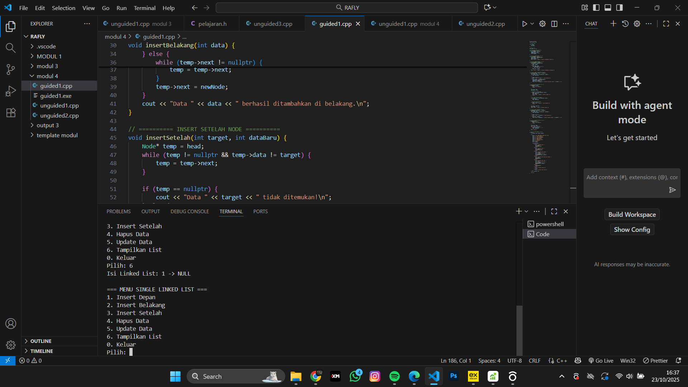
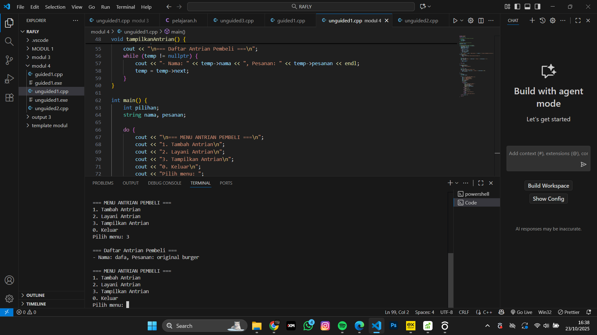
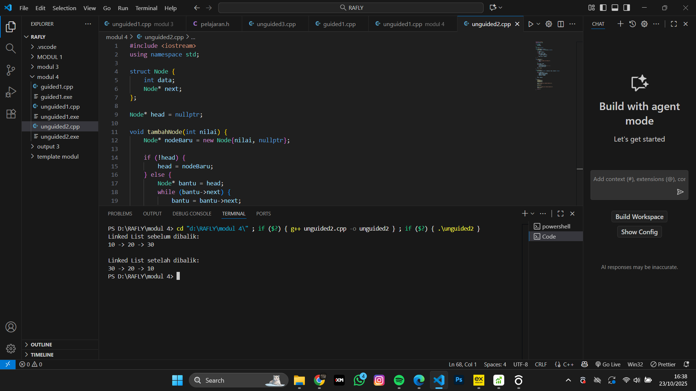

<h1 align="center">Laporan Praktikum Modul 4 <br>singly linked list bag 1</h1>
<p align="center">RAFLY ADINATA PRAYOGA - 103112430235</p>

## Dasar Teori
---
Singly Linked List adalah struktur data dinamis yang terdiri dari elemen-elemen yang disebut node.
> Setiap node memiliki dua bagian utama:
> Data: menyimpan nilai atau informasi.
> Pointer next: menunjuk ke node berikutnya di dalam list.
## Guided

### Soal 1


```cpp
#include <iostream>
using namespace std;

// Struktur Node
struct Node {
    int data;
    Node* next;
};

// Pointer awal
Node* head = nullptr;

// Fungsi untuk membuat node baru
Node* createNode(int data) {
    Node* newNode = new Node();
    newNode->data = data;
    newNode->next = nullptr;
    return newNode;
}

// ========== INSERT DEPAN ==========
void insertDepan(int data) {
    Node* newNode = createNode(data);
    newNode->next = head;
    head = newNode;
    cout << "Data " << data << " berhasil ditambahkan di depan.\n";
}

// ========== INSERT BELAKANG ==========
void insertBelakang(int data) {
    Node* newNode = createNode(data);
    if (head == nullptr) {
        head = newNode;
    } else {
        Node* temp = head;
        while (temp->next != nullptr) {
            temp = temp->next;
        }
        temp->next = newNode;
    }
    cout << "Data " << data << " berhasil ditambahkan di belakang.\n";
}

// ========== INSERT SETELAH NODE ==========
void insertSetelah(int target, int dataBaru) {
    Node* temp = head;
    while (temp != nullptr && temp->data != target) {
        temp = temp->next;
    }

    if (temp == nullptr) {
        cout << "Data " << target << " tidak ditemukan!\n";
    } else {
        Node* newNode = createNode(dataBaru);
        newNode->next = temp->next;
        temp->next = newNode;
        cout << "Data " << dataBaru << " berhasil disisipkan setelah " << target << ".\n";
    }
}

// ========== DELETE FUNCTION ==========
void hapusNode(int data) {
    if (head == nullptr) {
        cout << "List kosong!\n";
        return;
    }

    Node* temp = head;
    Node* prev = nullptr;

    // Jika data di node pertama
    if (temp != nullptr && temp->data == data) {
        head = temp->next;
        delete temp;
        cout << "Data " << data << " berhasil dihapus.\n";
        return;
    }

    // Cari node yang akan dihapus
    while (temp != nullptr && temp->data != data) {
        prev = temp;
        temp = temp->next;
    }

    // Jika data tidak ditemukan
    if (temp == nullptr) {
        cout << "Data " << data << " tidak ditemukan!\n";
        return;
    }

    prev->next = temp->next;
    delete temp;
    cout << "Data " << data << " berhasil dihapus.\n";
}

// ========== UPDATE FUNCTION ==========
void updateNode(int dataLama, int dataBaru) {
    Node* temp = head;
    while (temp != nullptr && temp->data != dataLama) {
        temp = temp->next;
    }

    if (temp == nullptr) {
        cout << "Data " << dataLama << " tidak ditemukan!\n";
    } else {
        temp->data = dataBaru;
        cout << "Data " << dataLama << " berhasil diupdate menjadi " << dataBaru << ".\n";
    }
}

// ========== DISPLAY FUNCTION ==========
void tampilkanList() {
    if (head == nullptr) {
        cout << "List kosong!\n";
        return;
    }

    Node* temp = head;
    cout << "Isi Linked List: ";
    while (temp != nullptr) {
        cout << temp->data << " -> ";
        temp = temp->next;
    }
    cout << "NULL\n";
}

// ========== MAIN PROGRAM ==========
int main() {
    int pilihan, data, target, dataBaru;

    do {
        cout << "\n=== MENU SINGLE LINKED LIST ===\n";
        cout << "1. Insert Depan\n";
        cout << "2. Insert Belakang\n";
        cout << "3. Insert Setelah\n";
        cout << "4. Hapus Data\n";
        cout << "5. Update Data\n";
        cout << "6. Tampilkan List\n";
        cout << "0. Keluar\n";
        cout << "Pilih: ";
        cin >> pilihan;

        switch (pilihan) {
            case 1:
                cout << "Masukkan data: ";
                cin >> data;
                insertDepan(data);
                break;
            case 2:
                cout << "Masukkan data: ";
                cin >> data;
                insertBelakang(data);
                break;
            case 3:
                cout << "Masukkan data target: ";
                cin >> target;
                cout << "Masukkan data baru: ";
                cin >> dataBaru;
                insertSetelah(target, dataBaru);
                break;
            case 4:
                cout << "Masukkan data yang ingin dihapus: ";
                cin >> data;
                hapusNode(data);
                break;
            case 5:
                cout << "Masukkan data lama: ";
                cin >> data;
                cout << "Masukkan data baru: ";
                cin >> dataBaru;
                updateNode(data, dataBaru);
                break;
            case 6:
                tampilkanList();
                break;
            case 0:
                cout << "Program selesai.\n";
                break;
            default:
                cout << "Pilihan tidak valid!\n";
        }
    } while (pilihan != 0);

    return 0;
}

```

> Output
> insertDepan() → menambahkan node baru di awal list.
> insertBelakang() → menambahkan node di akhir list.
> insertSetelah() → menyisipkan node setelah node tertentu.
> hapusNode() → menghapus node berdasarkan data.
> updateNode() → mengganti data lama dengan data baru.
> tampilkanList() → menampilkan seluruh isi linked list.
> 


## Unguided

### Soal 1
1. buatlah single linked list untuk Antrian yang menyimpan data pembeli( nama dan pesanan). program memiliki beberapa menu seperti tambah antrian, layani antrian(hapus), dan tampilkan antrian. *antrian pertama harus yang pertama dilayani

```cpp
#include <iostream>
#include <string>
using namespace std;

// Struktur Node untuk menyimpan data pembeli
struct Node {
    string nama;
    string pesanan;
    Node* next;
};

// Pointer head dan tail untuk antrian
Node* head = nullptr;
Node* tail = nullptr;

// Fungsi untuk menambah antrian (di belakang)
void tambahAntrian(string nama, string pesanan) {
    Node* newNode = new Node();
    newNode->nama = nama;
    newNode->pesanan = pesanan;
    newNode->next = nullptr;

    if (head == nullptr) {
        head = tail = newNode;
    } else {
        tail->next = newNode;
        tail = newNode;
    }
    cout << "Pembeli " << nama << " dengan pesanan \"" << pesanan << "\" berhasil ditambahkan ke antrian.\n";
}
void layaniAntrian() {
    if (head == nullptr) {
        cout << "Antrian kosong! Tidak ada yang bisa dilayani.\n";
        return;
    }

    Node* temp = head;
    cout << "Melayani pembeli: " << head->nama << " (Pesanan: " << head->pesanan << ")\n";
    head = head->next;

    if (head == nullptr) {
        tail = nullptr; 
    }

    delete temp;
}

void tampilkanAntrian() {
    if (head == nullptr) {
        cout << "Antrian kosong.\n";
        return;
    }

    Node* temp = head;
    cout << "\n=== Daftar Antrian Pembeli ===\n";
    while (temp != nullptr) {
        cout << "- Nama: " << temp->nama << ", Pesanan: " << temp->pesanan << endl;
        temp = temp->next;
    }
}

int main() {
    int pilihan;
    string nama, pesanan;

    do {
        cout << "\n=== MENU ANTRIAN PEMBELI ===\n";
        cout << "1. Tambah Antrian\n";
        cout << "2. Layani Antrian\n";
        cout << "3. Tampilkan Antrian\n";
        cout << "0. Keluar\n";
        cout << "Pilih menu: ";
        cin >> pilihan;
        cin.ignore();

        switch (pilihan) {
            case 1:
                cout << "Masukkan nama pembeli: ";
                getline(cin, nama);
                cout << "Masukkan pesanan: ";
                getline(cin, pesanan);
                tambahAntrian(nama, pesanan);
                break;
            case 2:
                layaniAntrian();
                break;
            case 3:
                tampilkanAntrian();
                break;
            case 0:
                cout << "Program selesai.\n";
                break;
            default:
                cout << "Pilihan tidak valid!\n";
        }
    } while (pilihan != 0);

    return 0;
}
```

> Output
> pointer head dan tail untuk mengelola antrian.Ketika pembeli ditambahkan, data baru akan berada di akhir antrian. Saat dilayani, node pertama (head) dihapus dari list.
> 

---

### Soal 2

2. buatlah program kode untuk membalik (reverse) singly linked list (1-2-3 menjadi 3-2-1)

```cpp
#include <iostream>
using namespace std;

struct Node {
    int data;
    Node* next;
};

Node* head = nullptr;

void tambahNode(int nilai) {
    Node* nodeBaru = new Node{nilai, nullptr};

    if (!head) {
        head = nodeBaru;
    } else {
        Node* bantu = head;
        while (bantu->next) {
            bantu = bantu->next;
        }
        bantu->next = nodeBaru;
    }
}

void tampilList() {
    if (!head) {
        cout << "Linked List kosong.\n";
        return;
    }

    Node* bantu = head;
    while (bantu) {
        cout << bantu->data;
        if (bantu->next) cout << " -> ";
        bantu = bantu->next;
    }
    cout << endl;
}

void balikList() {
    Node *sebelum = nullptr, *sekarang = head, *sesudah = nullptr;

    while (sekarang) {
        sesudah = sekarang->next;
        sekarang->next = sebelum;
        sebelum = sekarang;
        sekarang = sesudah;
    }

    head = sebelum;
}

int main() {
    tambahNode(10);
    tambahNode(20);
    tambahNode(30);

    cout << "Linked List sebelum dibalik:\n";
    tampilList();

    balikList();

    cout << "\nLinked List setelah dibalik:\n";
    tampilList();

    return 0;
}

```

> Output
> fungsi balikList():
> Menggunakan tiga pointer: sebelum, sekarang, dan sesudah
> Secara bertahap mengubah arah pointer next dari setiap node.
> 


---

## Referensi
> Koffman, E. B., & Wolfgang, P. A. T. (2010). Data Structures: Abstraction and Design Using Java. Wiley.
> Malik, D. S. (2018). Data Structures Using C++. Cengage Learning.
> GeeksforGeeks. (n.d.). Singly Linked List in C++
> Tutorialspoint. (n.d.). C++ Linked List Data Structure

