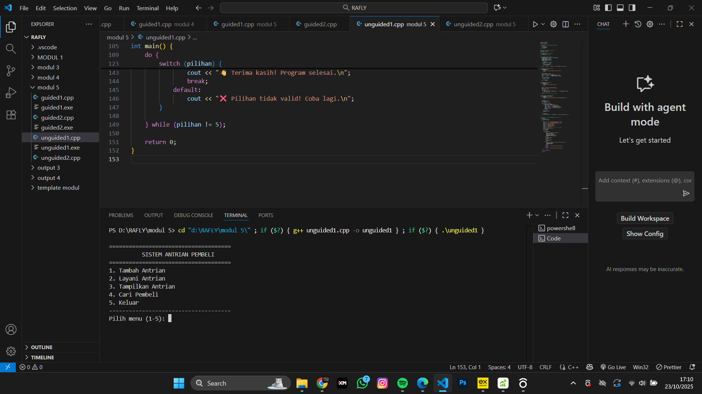

<h1 align="center">Laporan Praktikum Modul 5 <br>singly linked list bag 2</h1>
<p align="center">RAFLY ADINATA PRAYOGA - 103112430235</p>

## Dasar Teori
---
Singly Linked List adalah struktur data dinamis yang terdiri dari elemen-elemen yang disebut node.
> Setiap node memiliki dua bagian utama:
> Data: menyimpan nilai atau informasi.
> Pointer next: menunjuk ke node berikutnya di dalam list.
## Guided

### Soal 1
> linkedlist.cpp
```cpp
#include <iostream>
using namespace std;

// Struktur Node
struct Node {
    int data;
    Node* next;
};

// Pointer awal dan akhir
Node* head = nullptr;

// Fungsi untuk membuat node baru
Node* createNode(int data) {
    Node* newNode = new Node();
    newNode->data = data;
    newNode->next = nullptr;
    return newNode;
}


void insertBelakang(int data) {
    Node* newNode = createNode(data);
    if (head == nullptr) {
        head = newNode;
    } else {
        Node* temp = head;
        while (temp->next != nullptr) {
            temp = temp->next;
        }
        temp->next = newNode;
    }
    cout << "Data " << data << " berhasil ditambahkan di belakang.\n";
}

void insertSetelah(int target, int dataBaru) {
    Node* temp = head;
    while (temp != nullptr && temp->data != target) {
        temp = temp->next;
    }

    if (temp == nullptr) {
        cout << "Data " << target << " tidak ditemukan!\n";
    } else {
        Node* newNode = createNode(dataBaru);
        newNode->next = temp->next;
        temp->next = newNode;
        cout << "Data " << dataBaru << " berhasil disisipkan setelah " << target << ".\n";
    }
}

// ========== DELETE FUNCTION ==========
void hapusNode(int data) {
    if (head == nullptr) {
        cout << "List kosong!\n";
        return;
    }

    Node* temp = head;
    Node* prev = nullptr;

    // Jika data di node pertama
    if (temp != nullptr && temp->data == data) {
        head = temp->next;
        delete temp;
        cout << "Data " << data << " berhasil dihapus.\n";
        return;
    }

    // Cari node yang akan dihapus
    while (temp != nullptr && temp->data != data) {
        prev = temp;
        temp = temp->next;
    }

    // Jika data tidak ditemukan
    if (temp == nullptr) {
        cout << "Data " << data << " tidak ditemukan!\n";
        return;
    }

    prev->next = temp->next;
    delete temp;
    cout << "Data " << data << " berhasil dihapus.\n";
}

// ========== UPDATE FUNCTION ==========
void updateNode(int dataLama, int dataBaru) {
    Node* temp = head;
    while (temp != nullptr && temp->data != dataLama) {
        temp = temp->next;
    }

    if (temp == nullptr) {
        cout << "Data " << dataLama << " tidak ditemukan!\n";
    } else {
        temp->data = dataBaru;
        cout << "Data " << dataLama << " berhasil diupdate menjadi " << dataBaru << ".\n";
    }
}

// ========== DISPLAY FUNCTION ==========
void tampilkanList() {
    if (head == nullptr) {
        cout << "List kosong!\n";
        return;
    }

    Node* temp = head;
    cout << "Isi Linked List: ";
    while (temp != nullptr) {
        cout << temp->data << " -> ";
        temp = temp->next
    }
    cout << "NULL\n";
}

// ========== MAIN PROGRAM ==========
int main() {
    int pilihan, data, target, dataBaru;

    do {
        cout << "\n=== MENU SINGLE LINKED LIST ===\n";
        cout << "1. Insert Depan\n";
        cout << "2. Insert Belakang\n";
        cout << "3. Insert Setelah\n";
        cout << "4. Hapus Data\n";
        cout << "5. Update Data\n";
        cout << "6. Tampilkan List\n";
        cout << "0. Keluar\n";
        cout << "Pilih: ";
        cin >> pilihan;

        switch (pilihan) {
            case 1:
                cout << "Masukkan data: ";
                cin >> data;
                insertDepan(data);
                break;
            case 2:
                cout << "Masukkan data: ";
                cin >> data;
                insertBelakang(data);
                break;
            case 3:
                cout << "Masukkan data target: ";
                cin >> target;
                cout << "Masukkan data baru: ";
                cin >> dataBaru;
                insertSetelah(target, dataBaru);
                break;
            case 4:
                cout << "Masukkan data yang ingin dihapus: ";
                cin >> data;
                hapusNode(data);
                break;
            case 5:
                cout << "Masukkan data lama: ";
                cin >> data;
                cout << "Masukkan data baru: ";
                cin >> dataBaru;
                updateNode(data, dataBaru);
                break;
            case 6:
                tampilkanList();
                break;
            case 0:
                cout << "Program selesai.\n";
                break;
            default:
                cout << "Pilihan tidak valid!\n";
        }
    } while (pilihan != 0);

    return 0;
}
```

> Output
> 
> 


### Soal 2

> searching.cpp
```cpp
#include <iostream>
using namespace std;

#define Nil nullptr

// Deklarasi struktur Node
struct Node {
    int info;
    Node* next;

    Node(int value) {
        info = value;
        next = Nil;
    }
};

// Kelas List
class List {
private:
    Node* first;

public:
    // Konstruktor
    List() {
        first = Nil;
    }

    // Mengecek apakah list kosong
    bool isEmpty() {
        return first == Nil;
    }

    // Membuat list kosong
    void createList() {
        first = Nil;
    }

    // Menampilkan isi list
    void printInfo() {
        if (isEmpty()) {
            cout << "List kosong" << endl;
        } else {
            Node* p = first;
            cout << "Isi list: ";
            while (p != Nil) {
                cout << p->info << " ";
                p = p->next;
            }
            cout << endl;
        }
    }

    // Menghitung jumlah elemen
    int nbList() {
        int count = 0;
        Node* p = first;
        while (p != Nil) {
            count++;
            p = p->next;
        }
        return count;
    }

    // Menyisipkan elemen di awal
    void insertFirst(int value) {
        Node* p = new Node(value);
        p->next = first;
        first = p;
    }

    // Menyisipkan elemen di akhir
    void insertLast(int value) {
        Node* p = new Node(value);
        if (isEmpty()) {
            first = p;
        } else {
            Node* last = first;
            while (last->next != Nil) {
                last = last->next;
            }
            last->next = p;
        }
    }

    // Menyisipkan elemen setelah node tertentu
    void insertAfter(Node* prec, int value) {
        if (prec != Nil) {
            Node* p = new Node(value);
            p->next = prec->next;
            prec->next = p;
        }
    }

    // Menghapus elemen pertama
    void delFirst() {
        if (!isEmpty()) {
            Node* temp = first;
            first = first->next;
            delete temp;
        }
    }

    // Menghapus elemen terakhir
    void delLast() {
        if (!isEmpty()) {
            if (first->next == Nil) {
                delete first;
                first = Nil;
            } else {
                Node* prev = Nil;
                Node* curr = first;
                while (curr->next != Nil) {
                    prev = curr;
                    curr = curr->next;
                }
                prev->next = Nil;
                delete curr;
            }
        }
    }

    // Menghapus elemen setelah node tertentu
    void delAfter(Node* prec) {
        if (prec != Nil && prec->next != Nil) {
            Node* temp = prec->next;
            prec->next = temp->next;
            delete temp;
        }
    }

    // Menghapus elemen dengan nilai tertentu
    void delP(int value) {
        if (isEmpty()) return;

        Node* curr = first;
        Node* prev = Nil;

        while (curr != Nil && curr->info != value) {
            prev = curr;
            curr = curr->next;
        }

        if (curr != Nil) { // ditemukan
            if (prev == Nil)
                first = curr->next;
            else
                prev->next = curr->next;
            delete curr;
        }
    }

    // Mencari elemen dengan nilai tertentu
    Node* findElm(int value) {
        Node* p = first;
        while (p != Nil) {
            if (p->info == value)
                return p;
            p = p->next;
        }
        return Nil;
    }

    // Membalik urutan elemen list
    void invertList() {
        Node* prev = Nil;
        Node* curr = first;
        Node* next = Nil;

        while (curr != Nil) {
            next = curr->next;
            curr->next = prev;
            prev = curr;
            curr = next;
        }
        first = prev;
    }

    // Menghapus semua elemen list
    void delAll() {
        Node* p = first;
        while (p != Nil) {
            Node* temp = p;
            p = p->next;
            delete temp;
        }
        first = Nil;
    }

    // Menyalin isi list ke list lain
    void copyList(List &L2) {
        delAll();
        Node* p = first;
        while (p != Nil) {
            L2.insertLast(p->info);
            p = p->next;
        }
    }

    // Destruktor
    ~List() {
        delAll();
    }
};

// Contoh penggunaan dalam main
int main() {
    List L;

    cout << "=== Program Linked List C++ ===" << endl;

    L.insertFirst(10);
    L.insertFirst(5);
    L.insertLast(15);
    L.insertLast(20);

    L.printInfo(); // Output: 5 10 15 20
    cout << "Jumlah elemen: " << L.nbList() << endl;

    cout << "Hapus elemen pertama..." << endl;
    L.delFirst();
    L.printInfo();

    cout << "Hapus elemen terakhir..." << endl;
    L.delLast();
    L.printInfo();

    cout << "Cari elemen bernilai 10..." << endl;
    Node* found = L.findElm(10);
    if (found) cout << "Ditemukan: " << found->info << endl;
    else cout << "Tidak ditemukan" << endl;

    cout << "Balik urutan list..." << endl;
    L.invertList();
    L.printInfo();

    cout << "Hapus semua elemen..." << endl;
    L.delAll();
    L.printInfo();

    return 0;
}

```

> Output
> 
> 


## Unguided

### Soal 1
1.buatlah searcing untuk mencari nama pembeli pada unguided sebelumnya

```cpp
#include <iostream>
#include <string>
using namespace std;

// Struktur Node untuk menyimpan data pembeli
struct Node {
    string nama;
    string pesanan;
    Node* next;
};

// Pointer antrian depan & belakang
Node* front = nullptr;
Node* rear = nullptr;

// Mengecek apakah antrian kosong
bool isEmpty() {
    return front == nullptr;
}

// Menambahkan pembeli ke antrian
void tambahAntrian(string nama, string pesanan) {
    Node* nodeBaru = new Node;
    nodeBaru->nama = nama;
    nodeBaru->pesanan = pesanan;
    nodeBaru->next = nullptr;

    if (isEmpty()) {
        front = rear = nodeBaru;
    } else {
        rear->next = nodeBaru;
        rear = nodeBaru;
    }
    cout << "🟩 Pembeli " << nama << " telah ditambahkan ke antrian.\n";
}

// Melayani antrian pertama (FIFO)
void layaniAntrian() {
    if (isEmpty()) {
        cout << "⚠️  Tidak ada pembeli dalam antrian!\n";
        return;
    }

    Node* nodeHapus = front;
    cout << "\n🚚 Melayani pesanan:\n";
    cout << "   Nama   : " << nodeHapus->nama << endl;
    cout << "   Pesanan: " << nodeHapus->pesanan << endl;

    front = front->next;
    if (front == nullptr)
        rear = nullptr;

    delete nodeHapus;
}

// Menampilkan seluruh antrian
void tampilAntrian() {
    if (isEmpty()) {
        cout << "📭 Antrian masih kosong.\n";
        return;
    }

    cout << "\n📋 Daftar Antrian Pembeli:\n";
    cout << "----------------------------\n";
    Node* temp = front;
    int i = 1;
    while (temp != nullptr) {
        cout << i++ << ". " << temp->nama << " - " << temp->pesanan << endl;
        temp = temp->next;
    }
    cout << "----------------------------\n";
}

// Mencari pembeli berdasarkan nama
void cariPembeli(string namaCari) {
    if (isEmpty()) {
        cout << "📭 Antrian kosong, pencarian tidak dapat dilakukan.\n";
        return;
    }

    Node* temp = front;
    int posisi = 1;
    bool ditemukan = false;

    while (temp != nullptr) {
        if (temp->nama == namaCari) {
            cout << "\n🔍 Pembeli ditemukan!\n";
            cout << "Posisi : " << posisi << endl;
            cout << "Nama   : " << temp->nama << endl;
            cout << "Pesanan: " << temp->pesanan << endl;
            cout << "----------------------------\n";
            ditemukan = true;
            break;
        }
        temp = temp->next;
        posisi++;
    }

    if (!ditemukan) {
        cout << "❌ Pembeli \"" << namaCari << "\" tidak ada dalam antrian.\n";
    }
}

// ==================== MAIN PROGRAM ====================
int main() {
    int pilihan;
    string nama, pesanan;

    do {
        cout << "\n=====================================\n";
        cout << "          SISTEM ANTRIAN PEMBELI     \n";
        cout << "=====================================\n";
        cout << "1. Tambah Antrian\n";
        cout << "2. Layani Antrian\n";
        cout << "3. Tampilkan Antrian\n";
        cout << "4. Cari Pembeli\n";
        cout << "5. Keluar\n";
        cout << "-------------------------------------\n";
        cout << "Pilih menu (1-5): ";
        cin >> pilihan;
        cin.ignore();

        switch (pilihan) {
            case 1:
                cout << "\nMasukkan Nama Pembeli : ";
                getline(cin, nama);
                cout << "Masukkan Pesanan      : ";
                getline(cin, pesanan);
                tambahAntrian(nama, pesanan);
                break;
            case 2:
                layaniAntrian();
                break;
            case 3:
                tampilAntrian();
                break;
            case 4:
                cout << "\nMasukkan nama pembeli yang ingin dicari: ";
                getline(cin, nama);
                cariPembeli(nama);
                break;
            case 5:
                cout << "👋 Terima kasih! Program selesai.\n";
                break;
            default:
                cout << "❌ Pilihan tidak valid! Coba lagi.\n";
        }

    } while (pilihan != 5);

    return 0;
}

```

> Output
> 
> 

---

### Soal 2

2. gunakan latihan pada pertemuan minggun ini dan tambahkan seardhing untuk mencari buku berdasarkan judul, penulis, dan ISBN

```cpp
#include <iostream>
#include <string>
using namespace std;

struct Buku {
    string isbn, judul, penulis;
    Buku* next;
};

Buku* head = nullptr;

void tambahBuku(const string& isbn, const string& judul, const string& penulis) {
    Buku* bukuBaru = new Buku{isbn, judul, penulis, nullptr};

    if (!head) {
        head = bukuBaru;
    } else {
        Buku* temp = head;
        while (temp->next) temp = temp->next;
        temp->next = bukuBaru;
    }
    cout << "Buku berhasil ditambahkan!\n";
}

void tampilBuku() {
    if (!head) {
        cout << "Tidak ada data buku.\n";
        return;
    }

    cout << "\nDaftar Buku:\n";
    for (Buku* temp = head; temp; temp = temp->next) {
        cout << "ISBN    : " << temp->isbn << endl;
        cout << "Judul   : " << temp->judul << endl;
        cout << "Penulis : " << temp->penulis << endl;
        cout << "-------------------------\n";
    }
}

void hapusBuku(const string& isbn) {
    if (!head) {
        cout << "Daftar buku kosong.\n";
        return;
    }

    Buku* temp = head;
    Buku* prev = nullptr;

    while (temp && temp->isbn != isbn) {
        prev = temp;
        temp = temp->next;
    }

    if (!temp) {
        cout << "Buku dengan ISBN " << isbn << " tidak ditemukan.\n";
        return;
    }

    if (!prev) head = head->next;
    else prev->next = temp->next;

    delete temp;
    cout << "Buku berhasil dihapus!\n";
}

void perbaruiBuku(const string& isbn) {
    Buku* temp = head;
    while (temp && temp->isbn != isbn) temp = temp->next;

    if (!temp) {
        cout << "Buku tidak ditemukan.\n";
        return;
    }

    cout << "Masukkan judul baru: ";
    getline(cin, temp->judul);
    cout << "Masukkan penulis baru: ";
    getline(cin, temp->penulis);
    cout << "Data buku berhasil diperbarui!\n";
}

void cariByISBN(const string& isbn) {
    Buku* temp = head;
    while (temp) {
        if (temp->isbn == isbn) {
            cout << "\nBuku ditemukan:\n";
            cout << "ISBN    : " << temp->isbn << endl;
            cout << "Judul   : " << temp->judul << endl;
            cout << "Penulis : " << temp->penulis << endl;
            cout << "-------------------------\n";
            return;
        }
        temp = temp->next;
    }
    cout << "Buku dengan ISBN " << isbn << " tidak ditemukan.\n";
}

void cariByJudul(const string& judul) {
    Buku* temp = head;
    bool ditemukan = false;

    while (temp) {
        if (temp->judul == judul) {
            if (!ditemukan)
                cout << "\nBuku dengan judul \"" << judul << "\" ditemukan:\n";
            cout << "ISBN    : " << temp->isbn << endl;
            cout << "Penulis : " << temp->penulis << endl;
            cout << "-------------------------\n";
            ditemukan = true;
        }
        temp = temp->next;
    }

    if (!ditemukan)
        cout << "Buku dengan judul \"" << judul << "\" tidak ditemukan.\n";
}

void cariByPenulis(const string& penulis) {
    Buku* temp = head;
    bool ditemukan = false;

    while (temp) {
        if (temp->penulis == penulis) {
            if (!ditemukan)
                cout << "\nBuku karya \"" << penulis << "\" ditemukan:\n";
            cout << "ISBN  : " << temp->isbn << endl;
            cout << "Judul : " << temp->judul << endl;
            cout << "-------------------------\n";
            ditemukan = true;
        }
        temp = temp->next;
    }

    if (!ditemukan)
        cout << "Tidak ditemukan buku karya \"" << penulis << "\".\n";
}

int main() {
    int pilihan;
    string isbn, judul, penulis;

    do {
        cout << "\n=== MENU DATA BUKU (Linked List) ===\n"
             << "1. Tambah Buku\n"
             << "2. Hapus Buku\n"
             << "3. Perbarui Buku\n"
             << "4. Lihat Semua Buku\n"
             << "5. Cari Buku (ISBN)\n"
             << "6. Cari Buku (Judul)\n"
             << "7. Cari Buku (Penulis)\n"
             << "8. Keluar\n"
             << "===================================\n"
             << "Pilih menu: ";
        cin >> pilihan;
        cin.ignore();

        switch (pilihan) {
            case 1:
                cout << "Masukkan ISBN: ";
                getline(cin, isbn);
                cout << "Masukkan Judul: ";
                getline(cin, judul);
                cout << "Masukkan Penulis: ";
                getline(cin, penulis);
                tambahBuku(isbn, judul, penulis);
                break;
            case 2:
                cout << "Masukkan ISBN buku yang akan dihapus: ";
                getline(cin, isbn);
                hapusBuku(isbn);
                break;
            case 3:
                cout << "Masukkan ISBN buku yang akan diperbarui: ";
                getline(cin, isbn);
                perbaruiBuku(isbn);
                break;
            case 4:
                tampilBuku();
                break;
            case 5:
                cout << "Masukkan ISBN yang ingin dicari: ";
                getline(cin, isbn);
                cariByISBN(isbn);
                break;
            case 6:
                cout << "Masukkan Judul yang ingin dicari: ";
                getline(cin, judul);
                cariByJudul(judul);
                break;
            case 7:
                cout << "Masukkan Penulis yang ingin dicari: ";
                getline(cin, penulis);
                cariByPenulis(penulis);
                break;
            case 8:
                cout << "Program selesai.\n";
                break;
            default:
                cout << "Pilihan tidak valid!\n";
        }
    } while (pilihan != 8);

    return 0;
}

```

> Output
> 
> 


---

## Referensi
> Koffman, E. B., & Wolfgang, P. A. T. (2010). Data Structures: Abstraction and Design Using Java. Wiley.
> Malik, D. S. (2018). Data Structures Using C++. Cengage Learning.
> GeeksforGeeks. (n.d.). Singly Linked List in C++
> Tutorialspoint. (n.d.). C++ Linked List Data Structure


