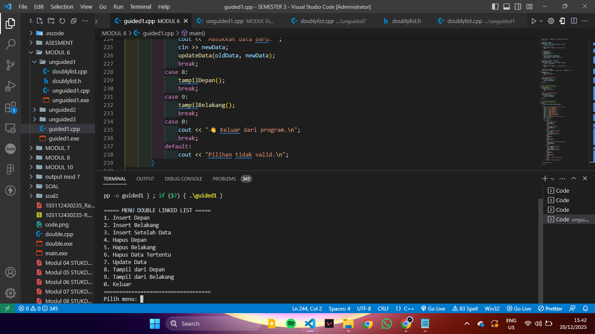
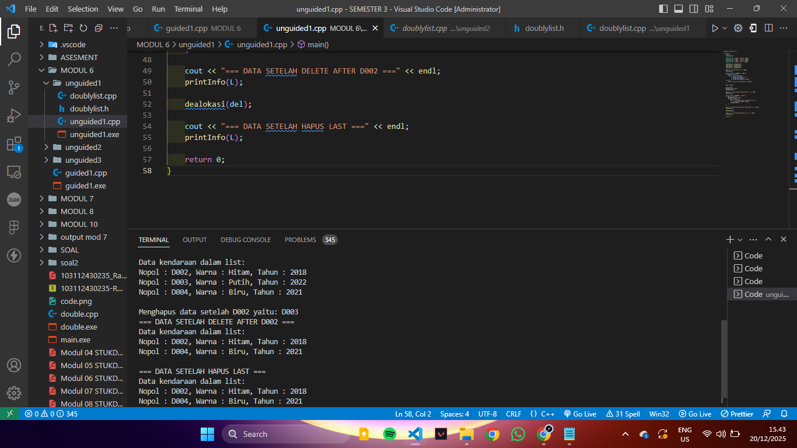

# <h1 align="center">Laporan Praktikum Struktur Data<br> Modul 6 double linked list</h1>
<p align="center">Rafly Adinata Prayoga / 103112430235</p>

## Dasar Teori

Doubly Linked List adalah struktur data dari rangkaian elemen node yang saling terhubung lewat dua pointer. next elemen selanjutnya dan prev  sebelumnya,  Struktur ini mempunyai dua penunjuk, yaitu first yang menunjuk ke elemen pertama dan last yang menunjuk ke elemen terakhir. Dengan adanya dua arah hubungan antar node, operasi seperti penyisipan, penghapusan, pencarian, dan pembaruan data bisa dilakukan lebih fleksibel dibandingkan dengan Singly Linked List, meskipun membutuhkan memori lebih besar karena setiap node menyimpan dua pointer.

## Guided

### Soal 1

```cpp
#include <iostream>
using namespace std;

// ==================
// Struktur Node
// ==================
struct Node {
    int data;
    Node* prev;
    Node* next;
};

// Pointer global
Node* head = nullptr;
Node* tail = nullptr;

// =================================
// FUNGSI UTAMA 
// =================================

// FUNGSI: Insert Depan (Dikoreksi)
void insertDepan(int data) {
    Node* newNode = new Node();
    newNode->data = data;
    newNode->prev = nullptr;
    newNode->next = head;

    if (head != nullptr) {
        head->prev = newNode;
    } else {
        tail = newNode; 
    }

    head = newNode;
    cout << "Data " << data << " berhasil ditambahkan di depan. \n";
}

// FUNGSI: Insert Belakang 
void insertBelakang(int data) {
    Node* newNode = new Node();
    newNode->data = data;
    newNode->next = nullptr;
    newNode->prev = tail;

    if (tail != nullptr) {
        tail->next = newNode;
    } else {
        head = newNode;
    }

    tail = newNode;
    cout << "Data " << data << " berhasil ditambahkan di belakang. \n";
}

// FUNGSI: Insert Setelah Data tertentu 
void insertSetelah(int target, int data) {
    // 1. Cari target
    Node* current = head; 
    while (current != nullptr && current->data != target) {
        current = current->next;
    }

    if (current == nullptr) {
        cout << "Data target " << target << " tidak ditemukan. \n";
        return;
    }
    
    // 2. Jika target adalah tail, panggil insertBelakang
    if (current == tail) {
        insertBelakang(data);
        return;
    }
    
    // 3. Insert di Tengah
    Node* newNode = new Node();
    newNode->data = data;
    
    newNode->next = current->next;
    newNode->prev = current;
    
    current->next->prev = newNode; // Tautan ke prev di node setelah current
    current->next = newNode;
    
    cout << "Data " << data << " berhasil disisipkan setelah " << target << ".\n";
}

// FUNGSI: Hapus di depan 
void hapusDepan() {
    if (head == nullptr) {
        cout << "List kosong.\n";
        return;
    }

    Node* temp = head;
    head = head->next;

    if (head != nullptr) {
        head->prev = nullptr;
    } else {
        tail = nullptr;
    }

    cout << "Data " << temp->data << " dihapus dari depan. \n";
    delete temp;
}

// FUNGSI: Hapus di belakang 
void hapusBelakang() {
    if (tail == nullptr) {
        cout << "List kosong. \n";
        return;
    }

    Node* temp = tail;
    tail = tail->prev;

    if (tail != nullptr) {
        tail->next = nullptr;
    } else {
        head = nullptr;
    }

    cout << "Data " << temp->data << " dihapus dari belakang. \n";
    delete temp;
}

// FUNGSI: Hapus Data Tertentu 
void hapusData(int target) {
    if (head == nullptr) {
        cout << "List kosong.\n";
        return;
    }

    Node* current = head; 
    
    // Cari node target
    while (current != nullptr && current->data != target) {
        current = current->next;
    }

    if (current == nullptr) {
        cout << "Data " << target << " tidak ditemukan. \n";
        return;
    }

    // KASUS 1: Hapus Head
    if (current == head) {
        hapusDepan();
    } 
    // KASUS 2: Hapus Tail
    else if (current == tail) {
        hapusBelakang();
    } 
    // KASUS 3: Hapus di Tengah
    else {
        current->prev->next = current->next;
        current->next->prev = current->prev;
        
        cout << "Data " << target << " dihapus. \n";
        delete current;
    }
}

// FUNGSI: Update Data 
void updateData(int oldData, int newData) {
    Node* current = head;
    
    // Cari node oldData
    while (current != nullptr && current->data != oldData) {
        current = current->next;
    }

    if (current == nullptr) {
        cout << "Data " << oldData << " tidak ditemukan untuk diperbarui. \n";
    } else {
        current->data = newData;
        cout << "Data " << oldData << " berhasil diperbarui menjadi " << newData << ". \n";
    }
}

// FUNGSI: Tampil dari Depan 
void tampilDepan() {
    if (head == nullptr) {
        cout << "List kosong.\n";
        return;
    }

    cout << "Isi list (dari depan): ";
    Node* current = head;
    while (current != nullptr) {
        cout << current->data << " ";
        current = current->next;
    }
    cout << "\n";
}

// FUNGSI: Tampil dari Belakang 
void tampilBelakang() {
    if (tail == nullptr) {
        cout << "List kosong.\n";
        return;
    }

    cout << "Isi list (dari belakang): ";
    Node* current = tail;
    while (current != nullptr) {
        cout << current->prev << " ";
        current = current->prev;
    }
    cout << "\n";
}

// ====================================
// MAIN PROGRAM (MENU INTERAKTIF)
// ====================================
int main() {
    int pilihan, data, target, oldData, newData;

    do {
        cout << "\n===== MENU DOUBLE LINKED LIST =====\n";
        cout << "1. Insert Depan\n";
        cout << "2. Insert Belakang\n";
        cout << "3. Insert Setelah Data\n";
        cout << "4. Hapus Depan\n";
        cout << "5. Hapus Belakang\n";
        cout << "6. Hapus Data Tertentu\n";
        cout << "7. Update Data\n";
        cout << "8. Tampil dari Depan\n";
        cout << "9. Tampil dari Belakang\n";
        cout << "0. Keluar\n";
        cout << "===================================\n";
        cout << "Pilih menu: ";
        
        if (!(cin >> pilihan)) {
            cout << "Input tidak valid.\n";
            cin.clear();
            cin.ignore(10000, '\n');
            pilihan = -1;
            continue;
        }

        switch (pilihan) {
            case 1:
                cout << "Masukkan data: ";
                cin >> data;
                insertDepan(data);
                break;
            case 2:
                cout << "Masukkan data: ";
                cin >> data;
                insertBelakang(data);
                break;
            case 3:
                cout << "Masukkan data target: ";
                cin >> target;
                cout << "Masukkan data baru: ";
                cin >> data;
                insertSetelah(target, data);
                break;
            case 4:
                hapusDepan();
                break;
            case 5:
                hapusBelakang();
                break;
            case 6:
                cout << "Masukkan data yang ingin dihapus: ";
                cin >> target;
                hapusData(target);
                break;
            case 7:
                cout << "Masukkan data lama: ";
                cin >> oldData;
                cout << "Masukkan data baru: ";
                cin >> newData;
                updateData(oldData, newData);
                break;
            case 8:
                tampilDepan();
                break;
            case 9:
                tampilBelakang();
                break;
            case 0:
                cout << " Keluar dari program.\n";
                break;
            default:
                cout << "Pilihan tidak valid.\n";
        }

    } while (pilihan != 0);

    return 0;
}
```
 
Output
 

Setiap node memiliki dua pointer, yaitu prev dan next, yang memungkinkan akses data dari dua arah. Program menyediakan menu interaktif untuk melakukan operasi insert, delete, update, dan tampil data. Data dapat ditambahkan di depan, belakang, atau setelah data tertentu, serta dihapus dari berbagai posisi. Hasil output menunjukkan bahwa pengelolaan data berjalan dengan baik menggunakan konsep doubly linked list.

---

## Unguided

### Soal 1

Buatlah implementasi ADT Doubly Linked list pada file “Doublylist.cpp” dan coba hasil implementasi ADT pada file “main.cpp”.
> doublylist.cpp
```cpp
#include "Doublylist.h"

void createList(List &L) {
    L.first = NULL;
    L.last = NULL;
}

address alokasi(infotype x) {
    address P = new ElmList;
    P->info = x;
    P->next = NULL;
    P->prev = NULL;
    return P;
}

void dealokasi(address &P) {
    delete P;
    P = NULL;
}

void insertLast(List &L, address P) {
    if (L.first == NULL) {
        L.first = P;
        L.last = P;
    } else {
        L.last->next = P;
        P->prev = L.last;
        L.last = P;
    }
}

void printInfo(List L) {
    address P = L.first;
    if (P == NULL) {
        cout << "List kosong." << endl;
        return;
    }
    cout << "Data kendaraan dalam list:" << endl;
    while (P != NULL) {
        cout << "Nopol : " << P->info.nopol
             << ", Warna : " << P->info.warna
             << ", Tahun : " << P->info.thnBuat << endl;
        P = P->next;
    }
    cout << endl;
}

address findElm(List L, string nopol) {
    address P = L.first;
    while (P != NULL) {
        if (P->info.nopol == nopol) {
            return P;
        }
        P = P->next;
    }
    return NULL;
}

void deleteFirst(List &L, address &P) {
    if (L.first != NULL) {
        P = L.first;
        if (L.first == L.last) {
            L.first = NULL;
            L.last = NULL;
        } else {
            L.first = L.first->next;
            L.first->prev = NULL;
            P->next = NULL;
        }
    }
}

void deleteLast(List &L, address &P) {
    if (L.last != NULL) {
        P = L.last;
        if (L.first == L.last) {
            L.first = NULL;
            L.last = NULL;
        } else {
            L.last = L.last->prev;
            L.last->next = NULL;
            P->prev = NULL;
        }
    }
}

void deleteAfter(address Prec, address &P) {
    if (Prec != NULL && Prec->next != NULL) {
        P = Prec->next;
        Prec->next = P->next;
        if (P->next != NULL) {
            P->next->prev = Prec;
        }
        P->next = NULL;
        P->prev = NULL;
    }
}
```
> doublylist.h
```cpp
#ifndef DOUBLYLIST_H
#define DOUBLYLIST_H

#include <iostream>
#include <string>
using namespace std;

struct kendaraan {
    string nopol;
    string warna;
    int thnBuat;
};

typedef kendaraan infotype;

struct ElmList {
    infotype info;
    ElmList *next;
    ElmList *prev;
};

typedef ElmList* address;

struct List {
    address first;
    address last;
};

void createList(List &L);
address alokasi(infotype x);
void dealokasi(address &P);
void insertLast(List &L, address P);
void printInfo(List L);
address findElm(List L, string nopol);
void deleteFirst(List &L, address &P);
void deleteLast(List &L, address &P);
void deleteAfter(address Prec, address &P);

#endif
```
> main.cpp
```cpp
#include "Doublylist.h"

int main() {
    List L;
    createList(L);

    kendaraan k1 = {"D001", "Merah", 2020};
    kendaraan k2 = {"D002", "Hitam", 2018};
    kendaraan k3 = {"D003", "Putih", 2022};
    kendaraan k4 = {"D004", "Biru", 2021};

    insertLast(L, alokasi(k1));
    insertLast(L, alokasi(k2));
    insertLast(L, alokasi(k3));
    insertLast(L, alokasi(k4));

    cout << "=== DATA AWAL ===" << endl;
    printInfo(L);

    address found = findElm(L, "D001");
    if (found != NULL) {
        cout << "Data ditemukan: "
             << found->info.nopol << ", "
             << found->info.warna << ", "
             << found->info.thnBuat << endl;
    } else {
        cout << "Data tidak ditemukan!" << endl;
    }

    cout << endl;

    address del;
    deleteFirst(L, del);
    dealokasi(del);

    cout << "=== DATA SETELAH HAPUS FIRST ===" << endl;
    printInfo(L);

    address prec = findElm(L, "D002");
    if (prec != NULL) {
        deleteAfter(prec, del);
        if (del != NULL) {
            cout << "Menghapus data setelah D002 yaitu: " 
                 << del->info.nopol << endl;
            dealokasi(del);
        }
    }

    cout << "=== DATA SETELAH DELETE AFTER D002 ===" << endl;
    printInfo(L);

    dealokasi(del);

    cout << "=== DATA SETELAH HAPUS LAST ===" << endl;
    printInfo(L);

    return 0;
}
```
 ⁠
Output
	 
	 
Doubly Linked List diimplementasikan dalam bentuk ADT yang dipisahkan ke dalam file header, implementasi, dan main. Setiap node menyimpan data kendaraan dan memiliki pointer next dan prev. Program menyediakan fungsi untuk menambah data, menampilkan data, mencari data, serta menghapus node di posisi tertentu.
---


## Referensi

1.⁠ ⁠[(https://www.geeksforgeeks.org/dsa/doubly-linked-list/)] [diakses 27-10-2025]
