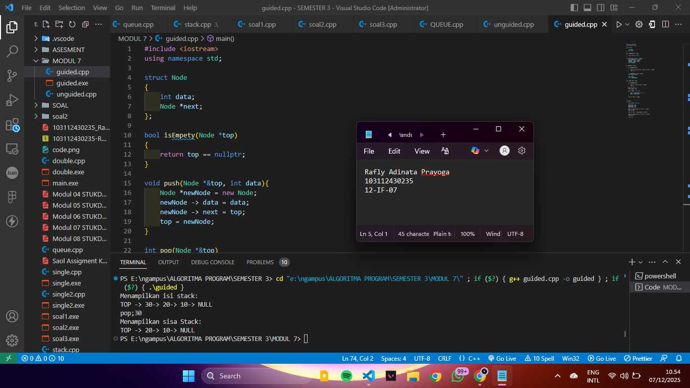
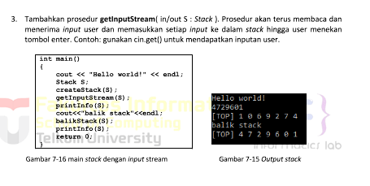
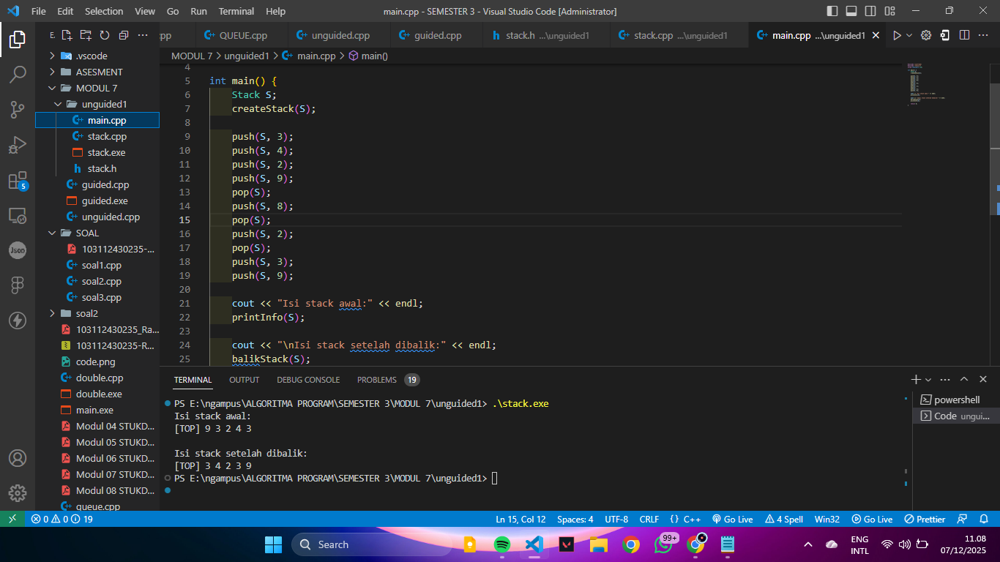
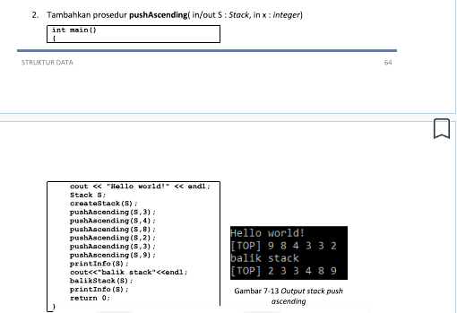
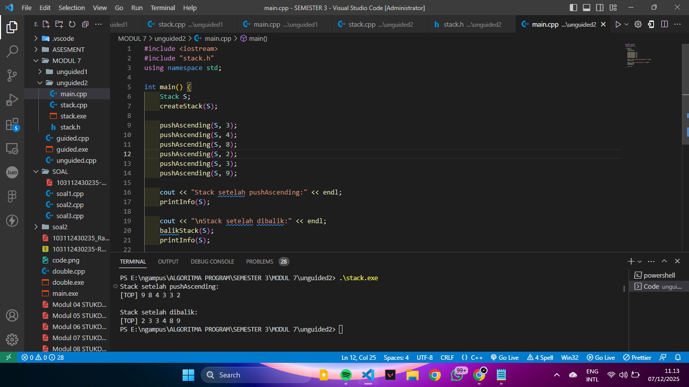
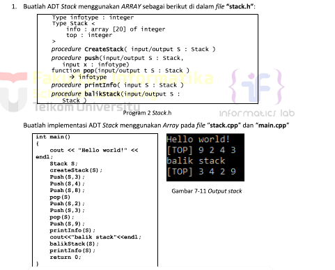
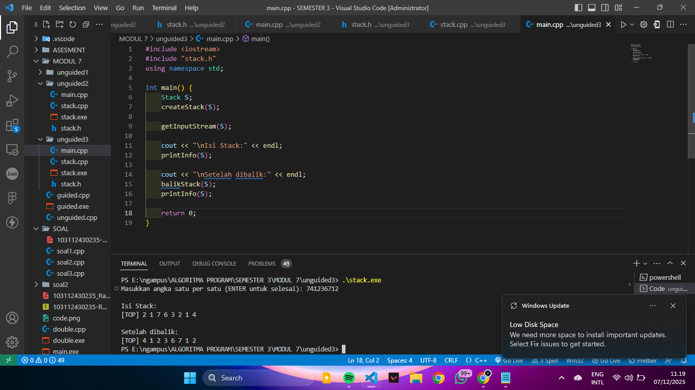

<h1 align="center">Laporan Praktikum Modul 7  <br>stack</h1>
<p align="center">RAFLY ADINATA PRAYOGA - 103112430235</p>

## Dasar Teori

Stack adalah struktur data yang memungkinkan ketika data terakhir masuk maka data pertama keluar atau disebut pop dan push

pop = menghaps dan mengambil elemen di bagian stack
push = menambahkan elemen ke atas stack

## Guided

### Soal 1

> 
```cpp
#include <iostream>
using namespace std;

struct Node
{
    int data;
    Node *next;
};

bool isEmpety(Node *top)
{
    return top == nullptr;
}

void push(Node *&top, int data){
    Node *newNode = new Node;
    newNode -> data = data;
    newNode -> next = top;
    top = newNode;
}

int pop(Node *&top)
{
    if (isEmpety(top))
    {
        cout << "Stack Kosong, tidak bisa pop!" << endl;
        return 0;
    }

    int poppedData = top -> data;
    top = top -> next;

    Node *temp;
    return poppedData;
}

void show (Node *top)
{
    if (isEmpety(top))
    {
        cout << "Stack kosong," << endl;
        return;
    }
    cout << "TOP -> ";
    Node *temp = top;

    while (temp != nullptr)
    {
        cout << temp->data << "-> ";
        temp = temp->next;
    }

    cout << "NULL" << endl;

}

int main()
{
    Node *stack = nullptr;

    push(stack, 10);
    push(stack, 20);
    push(stack, 30);

    cout << "Menampilkan isi stack:" << endl;
    show (stack);

    cout << "pop;" << pop(stack) << endl;

    cout << "Menampilkan sisa Stack:" << endl;
    show(stack);

    return 0;
}
```

> Output
> stack dinamis
> 


## Unguided

### Soal 

1. 

> stack.h
```cpp
#ifndef STACK_H
#define STACK_H

const int MAX = 20;
typedef int infotype;

struct Stack {
    infotype info[MAX];
    int top;
};

void createStack(Stack &S);
bool isEmpty(Stack S);
bool isFull(Stack S);
void push(Stack &S, infotype x);
infotype pop(Stack &S);
void printInfo(Stack S);

void balikStack(Stack &S);

#endif

```
> stack.cpp
```cpp
#include <iostream>
#include "stack.h"
using namespace std;

void createStack(Stack &S) {
    S.top = -1;
}

bool isEmpty(Stack S) {
    return S.top == -1;
}

bool isFull(Stack S) {
    return S.top == MAX - 1;
}

void push(Stack &S, infotype x) {
    if (!isFull(S)) {
        S.top++;
        S.info[S.top] = x;
    } else {
        cout << "Stack penuh!" << endl;
    }
}

infotype pop(Stack &S) {
    if (!isEmpty(S)) {
        infotype x = S.info[S.top];
        S.top--;
        return x;
    } else {
        cout << "Stack kosong!" << endl;
        return -1;
    }
}

void printInfo(Stack S) {
    if (isEmpty(S)) {
        cout << "Stack kosong!" << endl;
        return;
    }

    cout << "[TOP] ";
    for (int i = S.top; i >= 0; i--) {
        cout << S.info[i] << " ";
    }
    cout << endl;
}

void balikStack(Stack &S) {
    Stack temp;
    createStack(temp);

    while (!isEmpty(S)) {
        push(temp, pop(S));
    }
    S = temp;
}

```
> main.cpp
```cpp
#include <iostream>
#include "stack.h"
using namespace std;

int main() {
    Stack S;
    createStack(S);

    push(S, 3);
    push(S, 4);
    push(S, 2);
    push(S, 9);
    pop(S);
    push(S, 8);
    pop(S);
    push(S, 2);
    pop(S);
    push(S, 3);
    push(S, 9);

    cout << "Isi stack awal:" << endl;
    printInfo(S);

    cout << "\nIsi stack setelah dibalik:" << endl;
    balikStack(S);
    printInfo(S);

    return 0;
}   
```

> Output
> memindahkan elemen menggunakan strukdat yang sama
> 

---

### Soal 2

2. 

>stack.h
```cpp
#ifndef STACK_H
#define STACK_H

const int MAX = 20;
typedef int infotype;

struct Stack {
    infotype info[MAX];
    int top;
};

void createStack(Stack &S);
bool isEmpty(Stack S);
bool isFull(Stack S);
void push(Stack &S, infotype x);
infotype pop(Stack &S);
void printInfo(Stack S);

void balikStack(Stack &S);
void pushAscending(Stack &S, infotype x);

#endif
```
>stack.
```cpp
#include <iostream>
#include "stack.h"
using namespace std;

void createStack(Stack &S) {
    S.top = -1;
}

bool isEmpty(Stack S) {
    return S.top == -1;
}

bool isFull(Stack S) {
    return S.top == MAX - 1;
}

void push(Stack &S, infotype x) {
    if (!isFull(S)) {
        S.top++;
        S.info[S.top] = x;
    } else {
        cout << "Stack penuh!" << endl;
    }
}

infotype pop(Stack &S) {
    if (!isEmpty(S)) {
        infotype x = S.info[S.top];
        S.top--;
        return x;
    } else {
        cout << "Stack kosong!" << endl;
        return -1;
    }
}

void printInfo(Stack S) {
    if (isEmpty(S)) {
        cout << "Stack kosong!" << endl;
        return;
    }
    cout << "[TOP] ";
    for (int i = S.top; i >= 0; i--) {
        cout << S.info[i] << " ";
    }
    cout << endl;
}

void balikStack(Stack &S) {
    Stack temp;
    createStack(temp);

    while (!isEmpty(S)) {
        push(temp, pop(S));
    }
    S = temp;
}

void pushAscending(Stack &S, infotype x) {
    Stack temp;
    createStack(temp);

    while (!isEmpty(S) && S.info[S.top] > x) {
        push(temp, pop(S));
    }

    push(S, x);

    while (!isEmpty(temp)) {
        push(S, pop(temp));
    }
}

```

>main.cpp
```cpp
#include <iostream>
#include "stack.h"
using namespace std;

int main() {
    Stack S;
    createStack(S);

    pushAscending(S, 3);
    pushAscending(S, 4);
    pushAscending(S, 8);
    pushAscending(S, 2);
    pushAscending(S, 3);
    pushAscending(S, 9);

    cout << "Stack setelah pushAscending:" << endl;
    printInfo(S);

    cout << "\nStack setelah dibalik:" << endl;
    balikStack(S);
    printInfo(S);

    return 0;
}
```


> Output
> menggunakan pushAscending untuk menjaga stack tetap dalam urutan keatas
> 


---

### Soal 3

3. 

>stack.h
```cpp
#ifndef STACK_H
#define STACK_H

const int MAX = 20;
typedef int infotype;

struct Stack {
    infotype info[MAX];
    int top;
};

void createStack(Stack &S);
void push(Stack &S, infotype x);
infotype pop(Stack &S);
void printInfo(Stack S);
void balikStack(Stack &S);
void getInputStream(Stack &S);

#endif


```
>stack.cpp
```cpp
#include <iostream>
#include "stack.h"
using namespace std;

void createStack(Stack &S) {
    S.top = -1;
}

void push(Stack &S, infotype x) {
    if (S.top < MAX - 1) {
        S.top++;
        S.info[S.top] = x;
    } else {
        cout << "Stack penuh!" << endl;
    }
}

infotype pop(Stack &S) {
    if (S.top >= 0) {
        infotype x = S.info[S.top];
        S.top--;
        return x;
    } else {
        cout << "Stack kosong!" << endl;
        return -1;
    }
}

void printInfo(Stack S) {
    if (S.top < 0) {
        cout << "Stack kosong!" << endl;
        return;
    }

    cout << "[TOP] ";
    for (int i = S.top; i >= 0; i--) {
        cout << S.info[i] << " ";
    }
    cout << endl;
}

void balikStack(Stack &S) {
    Stack temp;
    createStack(temp);

    while (S.top >= 0) {
        push(temp, pop(S));
    }
    S = temp;
}

void getInputStream(Stack &S) {
    cout << "Masukkan angka satu per satu (ENTER untuk selesai): ";

    cin.ignore(); // membersihkan buffer sebelum membaca char
    char c;
    cin.get(c);

    while (c != '\n') {
        if (c >= '0' && c <= '9') {
            push(S, c - '0');
        } else {
            cout << "\nKarakter '" << c << "' diabaikan (bukan angka)" << endl;
        }
        cin.get(c);
    }
}
```
>main.cpp
```cpp
#include <iostream>
#include "stack.h"
using namespace std;

int main() {
    Stack S;
    createStack(S);

    getInputStream(S);

    cout << "\nIsi Stack:" << endl;
    printInfo(S);

    cout << "\nSetelah dibalik:" << endl;
    balikStack(S);
    printInfo(S);
https://cplusplus.com/reference/stack/stack/?utm_source=chatgpt.com
    return 0;
}
```

> Output
> fungsi getInputStream untuk membaca inputan (hanya angka) lalu stack ditampilkan dan dibalik
> 

## Referensi
> https://www.w3schools.com/cpp/cpp_stacks.asp

> https://cplusplus.com/reference/stack/stack/

> https://www.geeksforgeeks.org/stack-data-structure/


