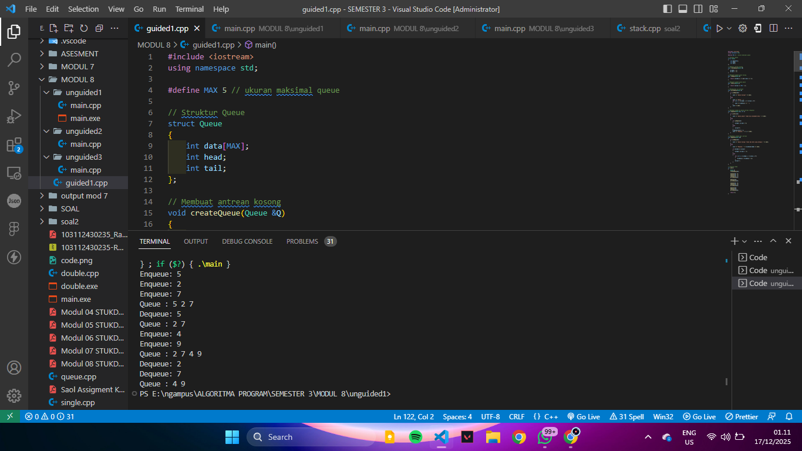
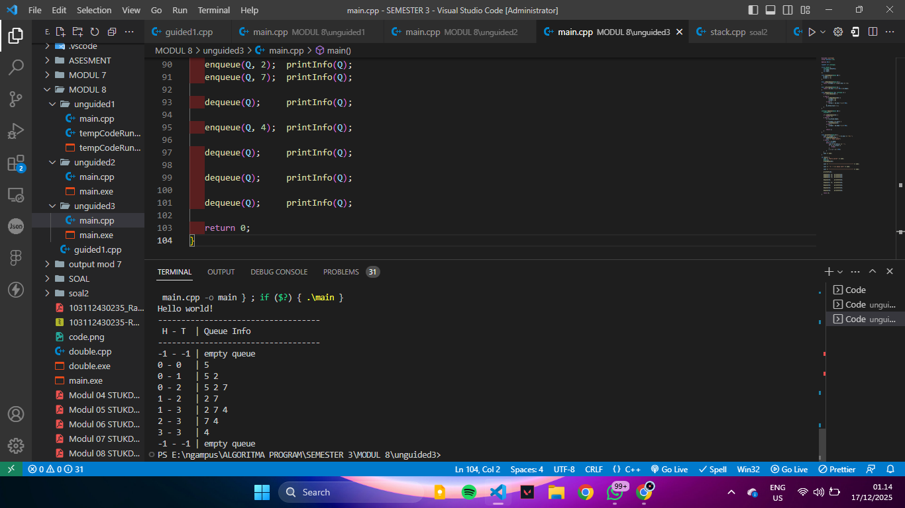
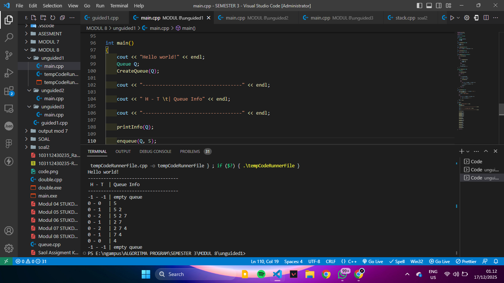

<h1 align="center">Laporan Praktikum Modul 8 <br>Queue</h1>
<p align="center">RAFLY ADINATA PRAYOGA - 103112430235</p>

## Dasar Teori
---
sama seperti stack, Queue juga menggunakan prinsip first in,first out (FIFO)

### Operasi Dasar Queue

1. enqueue(x) → memasukkan elemen ke bagian belakang queue
2. dequeue() → mengambil elemen dari bagian depan queue
3. front() → melihat elemen terdepan tanpa menghapus
4. isEmpty() → mengecek apakah queue kosong
5. isFull() → untuk queue berbasis array statis

## Guided

### Soal 1

```cpp
#include <iostream>
using namespace std;

#define MAX 5 // ukuran maksimal queue

// Struktur Queue
struct Queue
{
    int data[MAX];
    int head;
    int tail;
};

// Membuat antrean kosong
void createQueue(Queue &Q)
{
    Q.head = -1;
    Q.tail = -1;
}

// Mengecek apakah queue kosong
bool isEmpty(Queue Q)
{
    return (Q.head == -1 && Q.tail == -1);
}

// Mengecek apakah queue penuh
bool isFull(Queue Q)
{
    return (Q.tail == MAX - 1);
}

// Menampilkan isi antrean
void printQueue(Queue Q)
{
    if (isEmpty(Q))
    {
        cout << "Queue kosong!" << endl;
    }
    else
    {
        cout << "Queue : ";
        for (int i = Q.head; i <= Q.tail; i++)
        {
            cout << Q.data[i] << " ";
        }
        cout << endl;
    }
}

// Menambah elemen ke dalam antrean (Enqueue)
void enqueue(Queue &Q, int x)
{
    if (isFull(Q))
    {
        cout << "Queue penuh! Tidak bisa menambah data." << endl;
    }
    else
    {
        if (isEmpty(Q))
        {
            Q.head = Q.tail = 0;
        }
        else
        {
            Q.tail++;
        }
        Q.data[Q.tail] = x;
        cout << "Enqueue: " << x << endl;
    }
}

// Menghapus elemen dari antrean
void dequeue(Queue &Q)
{
    if (isEmpty(Q))
    {
        cout << "Queue kosong! Tiduk ada data yang dihapus." << endl;
    }
    else
    {
        cout << "Dequeue: " << Q.data[Q.head] << endl;

        if (Q.head == Q.tail)
        {
            Q.head = Q.tail = -1;
        }
        else
        {
            for (int i = Q.head; i < Q.tail; i++)
            {
                Q.data[i] = Q.data[i + 1];
            }
            Q.tail--;
        }
    }
}

// Program utama
int main()
{
    Queue Q;
    createQueue(Q);

    enqueue(Q, 5);
    enqueue(Q, 2);
    enqueue(Q, 7);
    printQueue(Q);

    dequeue(Q);
    printQueue(Q);

    enqueue(Q, 4);
    enqueue(Q, 9);
    printQueue(Q);

    dequeue(Q);
    dequeue(Q);
    printQueue(Q);

    return 0;
}
```

> Output
> menggunakan struktur data Queue yang disimpan dalam array berukuran tetap (maksimal 5 data). data yang masuk lebih dulu akan keluar lebih dulu, seperti orang mengantre.
Pada program utama, semua fungsi tersebut dicoba satu per satu, sehingga terlihat jelas cara menambah, menghapus, dan menampilkan data dalam antrian. ini disebut juga FIFO atau first in first out
> 


## Unguided

### soal 1 Buatlah implementasi ADT Queue pada file “queue.cpp” dengan menerapkan mekanisme queue Alternatif 1 (head diam, tail bergerak).
```cpp
#include <iostream>
using namespace std;

#define MAX 5

typedef int infotype;

struct Queue
{
    infotype info[MAX];
    int head;
    int tail;
};

void CreateQueue(Queue &Q)
{
    Q.head = -1;
    Q.tail = -1;
}

bool isEmptyQueue(Queue Q)
{
    return (Q.head == -1 && Q.tail == -1);
}

bool isFullQueue(Queue Q)
{
    return (Q.tail == MAX - 1);
}

void enqueue(Queue &Q, infotype x)
{
    if (isFullQueue(Q))
    {
    }
    else
    {
        if (isEmptyQueue(Q))
        {
            Q.head = 0;
            Q.tail = 0;
        }
        else
        {
            Q.tail++;
        }
        Q.info[Q.tail] = x;
    }
}

infotype dequeue(Queue &Q)
{
    infotype x;

    if (isEmptyQueue(Q))
    {
        return -1;
    }
    else
    {
        x = Q.info[Q.head];

        if (Q.head == Q.tail)
        {
            CreateQueue(Q);
        }
        else
        {
            for (int i = Q.head; i < Q.tail; i++)
            {
                Q.info[i] = Q.info[i + 1];
            }
            Q.tail--;
        }
        return x;
    }
}

void printInfo(Queue Q)
{
    cout << Q.head << " - " << Q.tail << "\t| ";
    if (isEmptyQueue(Q))
    {
        cout << "empty queue";
    }
    else
    {
        for (int i = Q.head; i <= Q.tail; i++)
        {
            cout << Q.info[i] << " ";
        }
    }
    cout << endl;
}

int main()
{
    cout << "Hello world!" << endl;
    Queue Q;
    CreateQueue(Q);

    cout << "-----------------------------------" << endl;

    cout << " H - T \t| Queue Info" << endl;

    cout << "-----------------------------------" << endl;

    printInfo(Q);

    enqueue(Q, 5);
    printInfo(Q);
    enqueue(Q, 2);
    printInfo(Q);
    enqueue(Q, 7);
    printInfo(Q);

    dequeue(Q);
    printInfo(Q);

    enqueue(Q, 4);
    printInfo(Q);

    dequeue(Q);
    printInfo(Q);

    dequeue(Q);
    printInfo(Q);

    dequeue(Q);
    printInfo(Q);

    return 0;
}
```

> Output
> posisi head selalu berada di indeks 0, sedangkan tail bergerak mengikuti jumlah data yang ada.
Setiap kali terjadi operasi dequeue, elemen paling depan dihapus, lalu seluruh data setelahnya digeser satu posisi ke depan agar head tetap berada di posisi awal.
> 

---

### Soal 2 Buatlah implementasi ADT Queue pada file “queue.cpp” dengan menerapkan mekanisme queue Alternatif 2 (head diam, tail bergerak).

```cpp
#include <iostream>
using namespace std;

#define MAX 5

typedef int infotype;

struct Queue {
    infotype info[MAX]; 
    int head;
    int tail;
};

void CreateQueue(Queue &Q) {
    Q.head = -1;
    Q.tail = -1;
}

bool isEmptyQueue(Queue Q) {
    return (Q.head == -1 && Q.tail == -1);
}

bool isFullQueue(Queue Q) {
    return (Q.head == 0 && Q.tail == MAX - 1);
}

void enqueue(Queue &Q, infotype x) {
    if (isFullQueue(Q)) {
    } else {
        if (isEmptyQueue(Q)) {
            Q.head = 0;
            Q.tail = 0;
            Q.info[Q.tail] = x;
        } else {
            if (Q.tail == MAX - 1) {
                int n = 0; 
                for (int i = Q.head; i <= Q.tail; i++) {
                    Q.info[n] = Q.info[i];
                    n++;
                }
                
                Q.head = 0;
                Q.tail = n - 1; 

                Q.tail++;
                Q.info[Q.tail] = x;

            } else {
                Q.tail++;
                Q.info[Q.tail] = x;
            }
        }
    }
}

infotype dequeue(Queue &Q) {
    infotype x; 

    if (isEmptyQueue(Q)) {
        return -1; 
    } else {
        x = Q.info[Q.head];
        if (Q.head == Q.tail) {
            CreateQueue(Q); 
        } else {
            Q.head++;
        }
        
        return x;
    }
}

void printInfo(Queue Q) {
    cout << Q.head << " - " << Q.tail << "\t| ";
    if (isEmptyQueue(Q)) { 
        cout << "empty queue";
    } else {
        for (int i = Q.head; i <= Q.tail; i++) {
            cout << Q.info[i] << " ";
        }
    }
    cout << endl;
} 

int main() {
    cout << "Hello world!" << endl; 
    Queue Q;                         
    CreateQueue(Q);                  

    cout << "-----------------------------------" << endl; 
    
    cout << " H - T \t| Queue Info" << endl;       
    
    cout << "-----------------------------------" << endl; 

    printInfo(Q); 
    
    enqueue(Q, 5);  printInfo(Q); 
    enqueue(Q, 2);  printInfo(Q); 
    enqueue(Q, 7);  printInfo(Q); 

    dequeue(Q);     printInfo(Q); 

    enqueue(Q, 4);  printInfo(Q); 

    dequeue(Q);     printInfo(Q); 
    
    dequeue(Q);     printInfo(Q);
    
    dequeue(Q);     printInfo(Q); 

    return 0;

}
```

> Output
> head dan tail sama-sama dapat bergerak.
Ketika elemen dihapus (dequeue), head berpindah ke indeks berikutnya tanpa menggeser data. Namun, jika tail sudah mencapai indeks terakhir array dan masih ada ruang kosong di depan (karena dequeue sebelumnya), maka dilakukan pergeseran data ke depan agar queue tetap bisa menampung elemen baru.
> 


---

### Soal 3 Buatlah implementasi ADT Queue pada file “queue.cpp” dengan menerapkan mekanisme queue Alternatif 3 (head diam, tail bergerak).

```cpp
#include <iostream>
using namespace std;

#define MAX 5

typedef int infotype;

struct Queue
{
    infotype info[MAX];
    int head;
    int tail;
};

void CreateQueue(Queue &Q)
{
    Q.head = -1;
    Q.tail = -1;
}

bool isEmptyQueue(Queue Q)
{
    return (Q.head == -1 && Q.tail == -1);
}

bool isFullQueue(Queue Q)
{
    return ((Q.tail + 1) % MAX == Q.head);
}

void enqueue(Queue &Q, infotype x)
{
    if (isFullQueue(Q))
    {
    }
    else
    {
        if (isEmptyQueue(Q))
        {
            Q.head = 0;
            Q.tail = 0;
        }
        else
        {
            Q.tail = (Q.tail + 1) % MAX;
        }
        Q.info[Q.tail] = x;
    }
}

infotype dequeue(Queue &Q)
{
    infotype x;

    if (isEmptyQueue(Q))
    {
        return -1;
    }
    else
    {
        x = Q.info[Q.head];

        if (Q.head == Q.tail)
        {
            CreateQueue(Q);
        }
        else
        {
            Q.head = (Q.head + 1) % MAX;
        }

        return x;
    }
}

void printInfo(Queue Q)
{
    cout << Q.head << " - " << Q.tail << "\t| ";
    if (isEmptyQueue(Q))
    {
        cout << "empty queue";
    }
    else
    {
        int i = Q.head;
        while (true)
        {
            cout << Q.info[i] << " ";
            if (i == Q.tail)
            {
                break;
            }
            i = (i + 1) % MAX;
        }
    }
    cout << endl;
}

int main()
{
    cout << "Hello world!" << endl;
    Queue Q;
    CreateQueue(Q);

    cout << "-----------------------------------" << endl;

    cout << " H - T \t| Queue Info" << endl;

    cout << "-----------------------------------" << endl;

    printInfo(Q);

    enqueue(Q, 5);
    printInfo(Q);
    enqueue(Q, 2);
    printInfo(Q);
    enqueue(Q, 7);
    printInfo(Q);

    dequeue(Q);
    printInfo(Q);

    enqueue(Q, 4);
    printInfo(Q);

    dequeue(Q);
    printInfo(Q);

    dequeue(Q);
    printInfo(Q);

    dequeue(Q);
    printInfo(Q);

    return 0;
}
```

> Output
> Array dianggap seperti lingkaran, sehingga ketika tail mencapai indeks terakhir, ia dapat kembali ke indeks awal jika masih tersedia ruang. Hal ini dicapai dengan operasi modulus (%).
> 

## Referensi
> https://www.geeksforgeeks.org/dsa/queue-data-structure/


